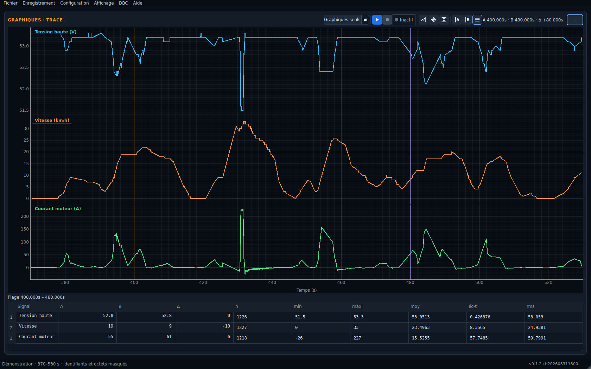
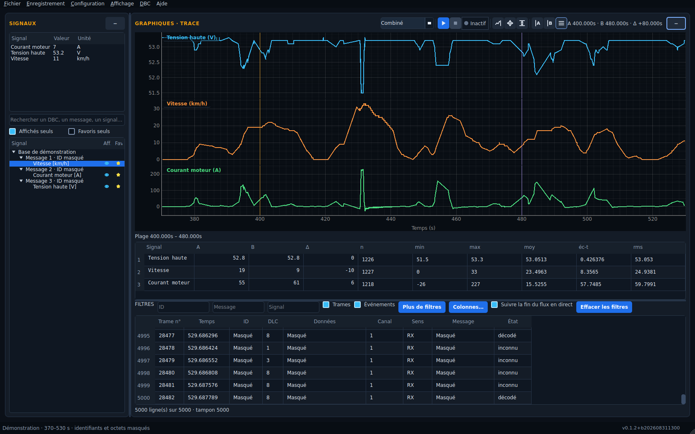
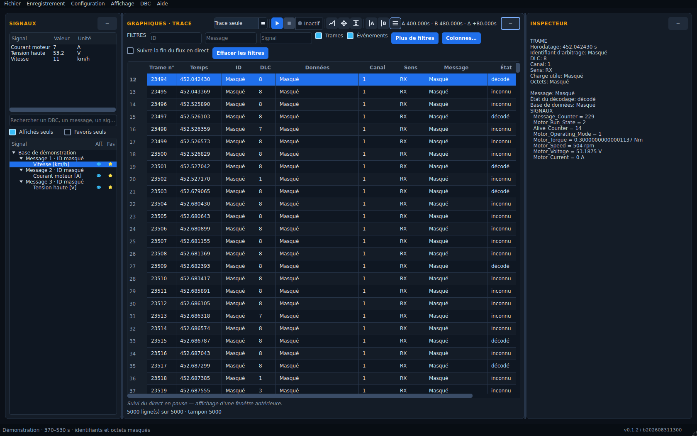
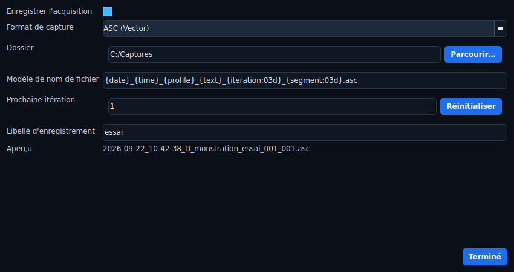
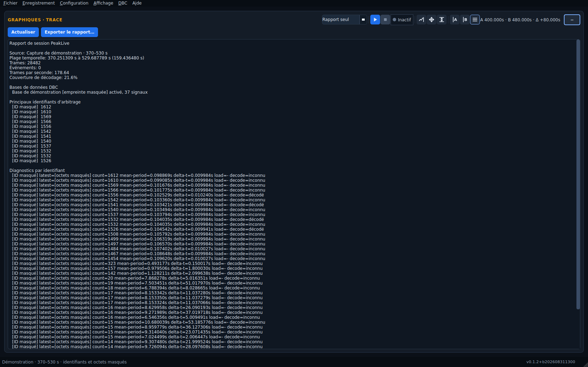

# PeakLive

**Du bus CAN aux courbes de mesure, dans un même espace de travail.**

PeakLive est une application de bureau pour acquérir, décoder, enregistrer et
analyser des données CAN. Elle accompagne les essais véhicule et la mise au
point : observer les signaux en direct, revenir sur un enregistrement, comparer
des grandeurs physiques et retrouver les trames à l'origine d'une observation.

Conçue pour **Windows 10/11 x64**, elle fonctionne entièrement en local, sans
compte ni service cloud. Son interface est en anglais. L'acquisition matérielle
utilise les interfaces **PEAK PCAN** ; un adaptateur simulé permet également de
développer et d'explorer l'application sans matériel CAN.



*Données réelles de roulage, entre 370 et 530 s. Les trois grandeurs conservent
leurs unités et partagent le même axe temporel ; les curseurs A/B permettent
d'examiner un intervalle commun.*

## Un espace de travail pour chaque étape de l'essai

| Vue | Utilisation |
| --- | --- |
| **Combo** | Rapprocher les courbes, les trames et le rapport dans un espace partagé. |
| **Graphs** | Donner toute la place aux signaux et aux mesures A/B. |
| **Trace** | Filtrer les trames et inspecter les données brutes et décodées. |
| **Report** | Lire la synthèse de session, la couverture DBC et les anomalies. |

L'explorateur de signaux et l'inspecteur peuvent être repliés. Les panneaux sont
redimensionnables, le plein écran facilite la lecture et le profil mémorise la
disposition. La barre commune regroupe le démarrage et l'arrêt, l'état du bus,
le suivi temporel, les ajustements des axes et les curseurs.



## Fonctionnalités

### Acquisition CAN en direct

- Un canal **Classic CAN**, avec choix de l'interface et du débit :
  125, 250, 500 ou 1 000 kbit/s.
- Commandes explicites **Start Acquisition** et **Stop Acquisition**, également
  accessibles avec `F5` et `F6`.
- Réception avec contrôleur normal ou écoute passive selon l'adaptateur.
  En mode normal, le contrôleur peut acquitter les trames ; en mode passif,
  il n'envoie pas d'acquittement.
- État du bus visible, signalement des erreurs et des déconnexions, indication
  de la finalisation et gestion des états de récupération.
- Réception, écriture et présentation séparées, avec traitement par lots et
  opérations en arrière-plan.

Restaurer un profil au lancement ne démarre jamais automatiquement le bus.
PeakLive ne propose pas d'émission de trames.

### Décodage multi-DBC et sélection des signaux

Chargez plusieurs **DBC**, puis parcourez leurs messages et signaux dans
l'explorateur. La recherche, les favoris et les commandes d'affichage permettent
de préparer une sélection adaptée à l'essai. Un récapitulatif présente les
signaux affichés, leur dernière valeur disponible et leur unité.

Le menu **DBC** permet d'activer, désactiver ou retirer une base. Si plusieurs
bases définissent le même identifiant, une résolution explicite permet de
choisir la définition. L'identité technique de chaque source reste disponible
pour distinguer les signaux homonymes.

Le décodage fournit les valeurs physiques, les unités et les valeurs énumérées.
Les signaux ajoutés à l'analyse peuvent être complétés à partir des trames
encore conservées dans le cache de session.

### Courbes synchronisées et historique

Chaque signal dispose d'une courbe, d'une couleur et d'un axe vertical. L'axe
temporel commun facilite la comparaison de grandeurs différentes, par exemple
le courant moteur, la vitesse du véhicule et la tension batterie.

- Zoom et déplacement sur la période étudiée.
- Ajustement **X + Y** pour retrouver l'étendue complète, ou **Y seulement**
  pour adapter les amplitudes sans perdre la fenêtre temporelle choisie.
- Suivi de toute la durée de l'acquisition ou d'une fenêtre glissante.
- Navigation manuelle qui désactive le suivi pour conserver la zone examinée.
- Historique de session sur disque, chargement selon la fenêtre visible et
  réduction du nombre de points pour les vues d'ensemble.

L'historique des courbes permet de revenir sur des échantillons plus anciens que
la projection en mémoire. Il reste distinct du fichier ASC/TRC à conserver pour
une analyse ultérieure.

### Curseurs A/B et mesures

Les curseurs A et B sont communs aux courbes et gardent leur position pendant
l'arrivée de nouvelles données. La barre affiche leur position et leur écart
temporel. La table de mesures donne, pour chaque signal :

- les valeurs en A et B et leur différence ;
- le nombre d'échantillons dans l'intervalle ;
- le minimum, le maximum, la moyenne, l'écart-type et la valeur efficace (RMS) ;
- la distribution des valeurs pour les signaux énumérés.

La table peut être masquée pour agrandir les courbes sans supprimer les curseurs.

### Trace CAN et inspecteur de trames

La trace chronologique affiche les trames et les événements de session. Les
filtres portent sur l'identifiant, le message, le signal, la direction, le type
d'événement, le statut de décodage et la plage temporelle. Les filtres actifs
sont visibles et peuvent être retirés individuellement.

Les colonnes sont configurables : visibilité, ordre, largeur et format des
valeurs. Les commandes de copie facilitent la réutilisation des informations
dans un compte rendu ou une investigation.

Sélectionner une trame ouvre son détail dans l'inspecteur : horodatage,
identifiant, charge utile, octets, message résolu et valeurs physiques décodées.
Les trames non décodables restent identifiables avec leur statut.
**Les filtres d'affichage ne filtrent pas l'enregistrement.**



### Enregistrement ASC ou TRC

L'enregistrement se configure par profil et peut être désactivé pour une simple
surveillance. Les formats proposés sont **ASC (Vector)** et **TRC texte
(PCAN-View)**.

Le dossier, le format, le modèle de nom, le texte de l'essai et la prochaine
itération sont configurables, avec un aperçu du nom produit. Exemple de modèle :

```text
{date}_{time}_{profile}_{text}_{iteration:03d}_{segment:03d}.asc
```

La numérotation évite d'écraser une capture existante. L'enregistrement gère la
rotation en segments et les seuils d'espace disque. Les marqueurs de fichier
partiel et les métadonnées distinguent une session finalisée d'une interruption.
Les événements complémentaires sont conservés dans un fichier associé
`.peaklive-events.jsonl`.



### Relecture et export

Ouvrez une capture **ASC** ou une variante prise en charge de **TRC texte**,
chargez les DBC correspondants et utilisez les mêmes outils de visualisation,
d'inspection et de mesure. Le chargement se fait en arrière-plan avec une
progression et le signalement des enregistrements non pris en charge.

L'export des signaux décodés propose **CSV** et **Parquet**, avec sélection des
signaux et de la portée : intervalle A/B, fenêtre visible ou ensemble du tampon
conservé. Il affiche sa progression et peut être annulé.

La portée de l'export dépend des échantillons disponibles dans le tampon de
signaux ; elle ne correspond pas nécessairement à tout le fichier brut ni à
l'historique de navigation des courbes.

### Rapport de session

La vue **Report** synthétise les volumes de trames, la cadence, la couverture de
décodage, les DBC chargés, les identifiants les plus présents et les anomalies
regroupées par type. Le rapport peut être actualisé et exporté en texte pour
accompagner un compte rendu d'essai.



*Ce rapport porte sur l'extrait illustré et les trois DBC chargés pour ces
visuels, pas sur l'ensemble du roulage ni sur toutes les bases du véhicule.*

### Profils réutilisables

Un profil conserve les réglages du bus, les DBC et leurs résolutions de conflits,
les favoris, les signaux affichés, les filtres, la disposition et les paramètres
d'enregistrement. **Setup → Save setup as** crée une copie indépendante pour
préparer un autre véhicule ou un nouvel essai.

Le dernier profil sélectionné est restauré au lancement. Les références aux
DBC absents sont signalées et conservées pour permettre de retrouver les fichiers.

## À propos des captures d'écran

Les visuels sont produits avec les widgets Qt du dépôt et les données réelles
de `demo_capture_010_001.asc`, limitées à **370–530 s**.
Les curseurs sont placés à **400 s** et **480 s**.

Les titres ont été adaptés pour la documentation, sans modifier les DBC ni les
valeurs. Ces alias ne représentent pas une fonction de renommage dans l'interface.

| Signal source | Libellé du visuel | Unité | DBC |
| --- | --- | --- | --- |
| `Edrv_iAct` | Courant moteur | A | `demo_motor.dbc` |
| `Ecran1.Vitesse` | Vitesse | km/h | `demo_dashboard.dbc` |
| `DCDC_ELEC_VALUE.DCDC_UHV` | Tension batterie | V | `DCDC_generic_DB.dbc` |

Le signal demandé comme `DCDC_Elec_Value_UHV` correspond, dans le DBC fourni, à
`DCDC_ELEC_VALUE.DCDC_UHV`. Les fichiers d'acquisition et les DBC privés ne sont
pas ajoutés au dépôt. Les captures sont rendues hors écran sous Linux ; les
décorations de fenêtre peuvent différer de Windows.

Voir la [procédure de reproduction des captures](docs/screenshots.md).

## Prise en main

### Analyser un enregistrement

1. Charger les DBC avec `Ctrl+D`, puis ouvrir la capture avec `Ctrl+O`.
2. Rechercher les signaux et activer leur affichage dans l'explorateur.
3. Passer en **Graphs**, ajuster les axes et zoomer sur la période utile.
4. Placer A et B pour mesurer, puis exporter les signaux avec `Ctrl+E`.
5. Consulter **Trace** et **Report** pour rapprocher les observations des trames
   et des anomalies.

### Réaliser une acquisition

1. Installer le pilote PEAK et connecter l'interface PCAN.
2. Choisir le profil, le canal, le débit et le mode du contrôleur dans **Setup**.
3. Charger les DBC et préparer la sélection de signaux.
4. Configurer l'enregistrement dans le menu **Recording**.
5. Démarrer avec `F5`, surveiller les courbes et l'état du bus, puis arrêter avec
   `F6` et attendre la finalisation.

## Raccourcis

| Raccourci | Action |
| --- | --- |
| `F5` / `F6` | Démarrer / arrêter l'acquisition |
| `Ctrl+D` | Charger des DBC |
| `Ctrl+O` | Ouvrir une trace ASC ou TRC |
| `Ctrl+E` | Exporter les signaux |
| `Ctrl+Shift+S` | Copier le profil avec Save setup as |
| `Ctrl+1` / `Ctrl+2` | Placer le curseur A / B |
| `Ctrl+0` | Ajuster les courbes à l'étendue complète |
| `Ctrl+F` | Accéder au filtre de trace |
| `Ctrl+B` | Replier / déplier le panneau de signaux |
| `F11` | Basculer en plein écran |
| `Ctrl+Q` | Quitter |

## Développement

Prérequis : **Python 3.13+** et [uv](https://docs.astral.sh/uv/).

```bash
uv sync --all-extras
uv run peaklive
uv run ruff check .
uv run pytest
uv build
```

La pile repose sur **PySide6/Qt**, **pyqtgraph**, **python-can** et **cantools**.
L'historique de session utilise SQLite. Pour les tests Qt sans écran sous Linux
ou en CI :

```bash
QT_QPA_PLATFORM=offscreen uv run pytest
```

`PEAKLIVE_DATA_DIR` isole les profils et données de développement.
`PEAKLIVE_ADAPTER=fake` force l'adaptateur simulé, également utilisé par défaut
hors Windows. Une simulation ne qualifie pas l'acquisition PCAN réelle.

## Exécutable Windows et périmètre

Exécuter `scripts/build-windows.ps1` depuis PowerShell pour produire
`dist/PeakLive.exe`, un exécutable autonome. Le pilote de l'adaptateur doit être
installé séparément.

Le périmètre actuel reste centré sur la réception d'un canal Classic CAN.
Le CAN FD, le LIN, l'émission de trames, la capture multicanal synchronisée,
les protocoles de diagnostic et les services cloud ne sont pas proposés.

La validation logicielle et la qualification sur bus réel sont distinctes.
Les procédures de [qualification Windows](docs/windows-qualification.md),
d'[acceptation matérielle](docs/windows-hardware-acceptance.md) et
d'[essai véhicule de dix minutes](docs/vehicle-test-10m.md) décrivent les preuves
à recueillir pour une livraison.

## Documentation

- [Périmètre produit et limites initiales](docs/product-scope.md)
- [Architecture](docs/architecture.md)
- [Identité des builds](docs/build-identity.md)
- [Choix de Python et Qt](docs/adr/0001-native-python-qt-stack.md)
- [Enregistrement et projections bornées](docs/adr/0002-lossless-recording-bounded-projections.md)
- [Interface d'adaptation matérielle](docs/adr/0003-hardware-adapter-boundary.md)
- [Notes de version 0.1.2](docs/release-notes-0.1.2.md)

Les demandes, décisions, tâches et validations sont suivies dans `logics/`.

## Licence

PeakLive est distribué sous [licence Apache 2.0](LICENSE).
