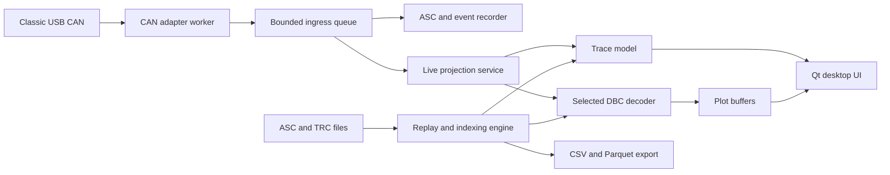

# PeakLive Architecture

## Architectural drivers

PeakLive must combine reliable Windows hardware access, complete capture,
responsive live presentation, reusable DBC logic, and analysis of files larger
than browser memory. It is local-only and optimized for a small engineering
team rather than multi-user service operation.

## Technology baseline

- Python 3.13 application packaged for Windows;
- PySide6 for the native desktop shell, accessibility, docking, and settings;
- pyqtgraph for high-rate interactive signal plots;
- python-can behind an internal adapter port for hardware access;
- cantools for DBC parsing and physical-value decoding;
- DuckDB and Arrow/Parquet for bounded offline analysis and exports;
- pytest plus Qt UI tests for deterministic component and workflow coverage;
- PyInstaller and a Windows installer definition for self-contained delivery.

Dependencies are pinned and bundled. The installed vendor driver and its native
API DLL remain machine prerequisites because redistributing the driver is not
assumed to be permitted.

## Runtime structure

### Desktop shell

The Qt shell owns application lifetime, windows, dock layouts, dialogs,
keyboard commands, and persistent user preferences. It adopts the existing
companion tool's visual vocabulary—dark instrument surface, signal explorer,
trace table, stacked plots, inspector, and A/B measurement cursors—without
embedding a browser or local web server.

### Domain core

The domain package contains immutable events and services that do not import
Qt or a concrete hardware API:

- `CanFrame`: timestamp, channel, arbitration ID, flags, DLC, and payload;
- `BusEvent`: error, state transition, overrun, connect, disconnect, and clock
  discontinuity;
- `CaptureSession`: configuration, monotonic/wall-clock anchors, paths, and
  clean/unclean state;
- `DecodedSample`: DBC identity, message, signal, raw value, physical value,
  unit, and enumeration text;
- ports for CAN adapters, recorders, replay readers, decoders, and exporters.

### Hardware adapter worker

The adapter runs outside the UI thread and exposes capability discovery rather
than assuming all future devices behave like the first adapter. It normalizes
driver callbacks or polling results into domain events and never mutates UI
models directly.

The first implementation supports one Classic USB CAN channel through the
vendor's installed Windows API. A fake adapter and a replay adapter are first-
class implementations used by tests and UI development without physical bus
access.

### Recording pipeline

The recorder is the highest-priority consumer. Acquisition events enter a
bounded queue with explicit high-water and overflow signals. The writer appends
ASC records in batches and periodically flushes according to a durability
policy. It also maintains a JSONL event sidecar for information that ASC cannot
represent consistently.

UI filtering happens after the recorder branch. Stopping the display, applying
filters, or changing plotted signals cannot alter the saved raw session.

### Live projection

The live table and plots receive batches at a controlled cadence. The table
keeps a bounded chronological window plus aggregate counters. Plot buffers keep
time/value samples only for selected signals and use min/max envelope
downsampling for display. Changing a filter rebuilds the visible projection
from the in-memory window; it does not query or rewrite the active ASC file.

### DBC decoding

DBC files are loaded into a catalog keyed by content hash. Ambiguous arbitration
IDs from non-equivalent messages are surfaced and require a deterministic user
choice. During live capture, only data needed by visible decoded columns,
selected plot signals, or explicitly enabled message inspection is decoded.
Offline analysis can decode broader selections through chunked workers and
persist derived columns in DuckDB/Arrow caches.

### Replay and export

ASC and supported text TRC readers normalize records into the same `CanFrame`
and `BusEvent` stream as live acquisition. Large files are scanned and indexed
incrementally. Exports operate on selected signals and time ranges and stream
CSV or Parquet output without materializing the complete trace in UI memory.

## Threading and backpressure

- the Qt main thread only applies pre-batched model changes and renders;
- one adapter worker owns the driver handle and receive lifecycle;
- one recorder worker owns each active capture file;
- decoding uses bounded worker execution and prioritizes visible/selected data;
- queue depths, dropped UI projections, driver overruns, and recorder pressure
  are observable metrics;
- recorder overflow is never hidden: the session is marked incomplete, an
  event is written if possible, and the UI enters a prominent degraded state.

Frames may be dropped from the live projection under extreme UI pressure, but
not intentionally from the recorder. If the recorder cannot keep up, PeakLive
must report that the recording is incomplete rather than claim losslessness.

## Persistence and paths

Application state is stored below `%LOCALAPPDATA%/PeakLive/`. Captures default
to a user-selectable directory under Documents. Real captures and DBC files are
never copied into the source repository. Settings include recent DBCs, display
filters, plot selection, window layout, bitrate, controller mode, and capture
directory, but never silently reconnect to a bus on application launch.

## Failure model

- **Adapter absent:** remain usable for replay and show an actionable state.
- **Adapter removed:** close the driver handle, emit a disconnect event, keep
  the recording recoverable, and offer/retry reconnection with bounded delay.
- **Bus warning/passive/off:** preserve transitions and expose reset actions.
- **Disk full or denied:** stop claiming a valid recording immediately, retain
  acquisition if safe, and surface the exact output path and remediation.
- **Malformed replay line:** retain an anomaly record and continue when safe.
- **DBC decode error:** preserve the raw frame and isolate the faulty message.
- **Process crash:** detect the partial session at next startup and offer
  recovery/finalization without rewriting the original evidence.

## Security and privacy

PeakLive has no listening network socket, cloud service, account, analytics, or
automatic upload. Imported and recorded data stays on local disks selected by
the user. Updates are manual in the MVP. Build provenance and dependency
licenses are recorded; executable signing is a later delivery decision.

## Evolution seams

- additional adapter plugins can add CAN FD or other vendors without changing
  the recorder and UI domain contracts;
- multi-channel support extends channel/session coordination rather than frame
  shape;
- V2 transmission adds a separate capability-gated transmit service; it does
  not reuse or weaken the receive-only path;
- protocol analyzers, dashboards, alarms, and scripting consume normalized
  events and decoded samples as optional modules.

