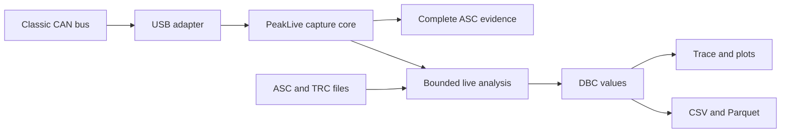

## prod_001_peaklive_windows_can_workstation - PeakLive Windows CAN Workstation
> Date: 2026-08-22
> Status: Proposed
> Related request: `req_000_deliver_the_peaklive_windows_can_workstation_mvp`
> Related backlog: `item_001_establish_the_native_windows_application_foundation`, `item_002_integrate_robust_classic_usb_can_acquisition`, `item_003_build_the_complete_and_recoverable_recording_pipeline`, `item_004_deliver_the_live_trace_and_display_only_filtering_workspace`, `item_005_add_deterministic_multi_dbc_live_decoding`, `item_006_render_bounded_real_time_signal_plots_and_measurements`, `item_007_implement_incremental_asc_and_trc_replay_with_decoded_export`, `item_008_package_and_qualify_the_windows_mvp`
> Related task: `task_001_orchestrate_the_peaklive_windows_can_workstation_mvp`
> Related architecture: (none yet)
> Reminder: Update status, linked refs, scope, decisions, success signals, and open questions when you edit this doc.
> Indicators reviewed: 2026-08-22 11:48:49

# Overview
A local, installable Windows workstation for reliable live CAN capture and high-performance DBC-driven trace analysis.

# Goals
- Make PeakLive the primary workstation for live acquisition and installed offline analysis for a three-engineer team.
- Protect capture integrity by separating the complete recording stream from bounded display projections.
- Offer a familiar instrument-style workflow across trace, signal explorer, plots, inspector, and exports.
- Create measurable adapter, decoder, recorder, and UI boundaries that support future hardware and transmission features.
- Keep all operational data local and make failures explicit and recoverable.

# Non-goals
- Transmit user-authored or cyclic CAN frames in the MVP.
- Provide dashboards, gauges, alarms, diagnostics protocols, or scripting in the MVP.
- Replace the companion browser tool for zero-install trace sharing.
- Support CAN FD, LIN, multiple synchronized channels, or every hardware vendor in the first release.
- Provide cloud accounts, remote collaboration, analytics, or automatic update services.

# Scope and guardrails
- In: one Classic CAN channel, explicit normal-receive/passive modes, assisted bitrate scan, robust reconnect, complete ASC recording plus event metadata, live trace, multi-DBC decode, bounded plots, ASC/TRC replay, CSV/Parquet export, local settings, and Windows x64 delivery.
- Out: frame transmission, dashboards, alarms, scripting, cloud features, CAN FD, synchronized multi-channel capture, automatic updates, and mandatory executable signing for the MVP.
- Guardrail: presentation filters and bounded UI buffers never define what enters a recording.
- Guardrail: known driver loss, recorder overflow, or unclean termination must remain visible and must invalidate a clean-capture claim.
- Guardrail: application-level receive-only and true passive listen-only are different controller behaviours and must be presented separately.

# Key product decisions
- Use a packaged Python/PySide6 desktop application rather than a browser shell or localhost service.
- Use a vendor-neutral adapter boundary with one Windows Classic USB implementation first.
- Write the complete normalized acquisition stream before applying display filters; keep only bounded live projections in memory.
- Use ASC as the interoperable frame artifact and a same-basename JSONL sidecar for non-portable acquisition events and integrity metadata.
- Decode visible, inspected, plotted, or exported data on demand; use chunked DuckDB/Arrow-backed processing for large offline traces.
- Keep the product offline and local-only, and never reconnect to a live bus silently at startup.

# Success signals
- A documented 60-minute maximum-practical-load run completes without recorder queue overflow on the reference workstation.
- The live interface remains interactive and presents eight selected decoded signals with typical latency below 250 ms under the reference load.
- Physical disconnect and reconnect are recoverable without restarting, and the discontinuity remains in the session evidence.
- ASC/TRC replay and selected CSV/Parquet export remain bounded on traces larger than available UI memory.
- A clean Windows machine can install, launch, use offline replay, detect the adapter prerequisite, and uninstall the packaged application.

# Open product decisions
- Confirm the exact supported Windows editions and oldest build used by the three engineers.
- Select the default common bitrate list and timeout/confidence policy for assisted scanning.
- Select default capture directory, filename template, rotation thresholds, and free-space warning policy.
- Decide whether the MVP installer is unsigned or whether code signing becomes a release gate.
- Choose the public repository license before code distribution starts.

# References
- Product back-reference: `req_000_deliver_the_peaklive_windows_can_workstation_mvp`
- Task back-reference: `task_001_orchestrate_the_peaklive_windows_can_workstation_mvp`
