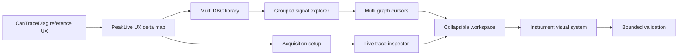

## prod_002_peaklive_cantracediag_grade_diagnostic_workspace - PeakLive CanTraceDiag-grade diagnostic workspace
> Date: 2026-08-24
> Status: Settled
> Related request: `req_001_bring_peaklive_ux_to_cantracediag_parity`
> Related backlog: `item_009_analyze_the_cantracediag_to_peaklive_ux_delta`
> Related task: `task_002_deliver_the_peaklive_cantracediag_ux_parity_delta`
> Related architecture: (none yet)
> Reminder: Update status, linked refs, scope, decisions, success signals, and open questions when you edit this doc.
> Indicators reviewed: 2026-08-24 14:43:19

# Overview
A refined PeakLive desktop workspace that brings the proven CanTraceDiag multi-DBC, signal, plotting, trace, inspector, and instrument-style UX into the live Windows CAN acquisition application.

# Goals
- Make DBC and signal workflows efficient enough for real multi-DBC engineering sessions.
- Translate CanTraceDiag's dense instrument UX into a native Qt desktop application while preserving PeakLive's live acquisition and recording boundaries.
- Let operators configure acquisition modes safely and understand the distinction between application receive-only, passive listen-only, and controller acknowledgement.
- Support several synchronized graphs and measurement cursors without hiding raw trace or inspector context.
- Keep validation fast, repeatable, and mostly hardware-independent, with any live CAN smoke run capped at 2 minutes.

# Non-goals
- Copy CanTraceDiag's browser implementation directly or turn PeakLive into a PWA.
- Add frame transmission, cyclic transmit, dashboards, alarms, diagnostic protocols, CAN FD, LIN, or multi-channel acquisition.
- Require a 60-minute or otherwise long live CAN bus validation for this UX request.
- Persist private DBC contents into the repository or upload any vehicle data.
- Replace the existing PeakLive domain boundaries or recorder integrity model.

# Scope and guardrails
- In: scaffolded request, product, backlog, orchestration task, validation, and handoff context.
- Out: unrelated workflow docs and implementation of generated tasks.

# Key product decisions
- Use structured input as the source of truth for generated docs.
- Keep generated write paths local and repo-bounded.

# Success signals
- Generated docs pass lint and audit without broad manual rewrites.
- Context-pack output can be handed to an implementation agent directly.

# References
- Product back-reference: `item_009_analyze_the_cantracediag_to_peaklive_ux_delta`
- Task back-reference: `task_002_deliver_the_peaklive_cantracediag_ux_parity_delta`
