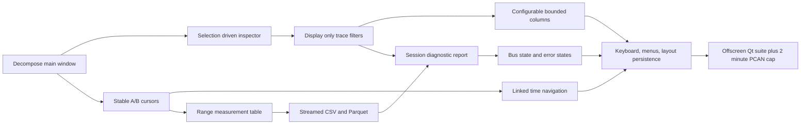

## prod_003_peaklive_analyst_measurement_and_reporting_workspace - PeakLive analyst measurement and reporting workspace
> Date: 2026-08-25
> Status: Proposed
> Related request: `req_002_complete_the_peaklive_analyst_workspace_to_cantracediag_parity`
> Related backlog: `item_016_make_the_frame_inspector_selection_driven`, `item_017_stabilize_a_b_cursors_and_add_graph_time_navigation`, `item_018_deliver_the_range_measurement_table`, `item_019_deliver_display_only_trace_filtering_with_active_filter_chips`, `item_020_deliver_configurable_bounded_trace_columns_and_paging`, `item_021_expose_streamed_csv_and_parquet_export_from_the_workspace`, `item_022_deliver_the_session_diagnostic_report`, `item_023_deliver_bus_state_error_and_loading_feedback`, `item_024_deliver_keyboard_accessibility_menus_and_layout_persistence`, `item_025_decompose_the_workspace_ui_into_modules_with_parity_regression_coverage`
> Related task: `task_003_deliver_the_peaklive_analyst_workspace_parity_wave`
> Related architecture: (none yet)
> Reminder: Update status, linked refs, scope, decisions, success signals, and open questions when you edit this doc.
> Indicators reviewed: 2026-08-25 11:36:52

# Overview
The second half of the CanTraceDiag-grade PeakLive workspace: once DBC management, signal navigation, and stacked plots exist, this brief covers what an analyst actually does with them - inspect a chosen frame, hold a measurement, quantify a range, filter and shape the trace, export the result, report the session, and do all of it from the keyboard on a bench machine.

# Goals
- Make frame-level inspection real by driving the inspector from the operator's trace selection.
- Make measurement trustworthy: cursors that stay where they were placed, and range statistics computed over the retained buffer.
- Make the trace view usable on a dense multi-DBC bus through display-only filtering, configurable columns, and bounded memory.
- Make the session's output reachable: streamed CSV and Parquet export over a chosen range, and a diagnostic report of what was captured.
- Make state legible: bus condition, decode conflicts, recording warnings, progress, and every empty or error case visible where the operator is looking.
- Make the workspace keyboard-operable, size-stable on bench screens, and structured in modules so further UX work stops accumulating in one file.

# Non-goals
- Add frame transmission, cyclic transmit, diagnostic protocols, CAN FD, LIN, or multi-channel acquisition.
- Port CanTraceDiag's browser implementation or introduce a web or PWA layer into PeakLive.
- Move analysis off the local machine or introduce any cloud, network, or telemetry dependency.
- Require a long connected-bus qualification run for a workspace change; any live PCAN evidence stays optional and capped at 2 minutes.
- Replace the PeakLive domain models, adapter boundary, or lossless recorder contract.

# Scope and guardrails
- In: scaffolded request, product, backlog, orchestration task, validation, and handoff context.
- Out: unrelated workflow docs and implementation of generated tasks.

# Key product decisions
- Use structured input as the source of truth for generated docs.
- Keep generated write paths local and repo-bounded.

# Success signals
- Generated docs pass lint and audit without broad manual rewrites.
- Context-pack output can be handed to an implementation agent directly.

# References
- Product back-reference: `req_002_complete_the_peaklive_analyst_workspace_to_cantracediag_parity`
- Task back-reference: `task_003_deliver_the_peaklive_analyst_workspace_parity_wave`
