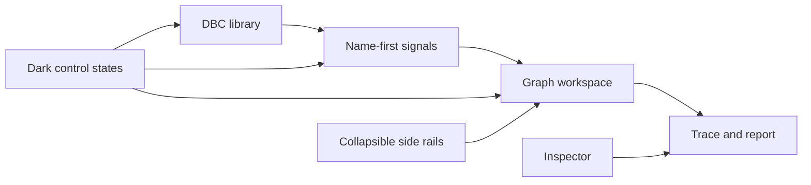

## prod_004_peaklive_dense_and_legible_diagnostic_workspace - PeakLive dense and legible diagnostic workspace
> Date: 2026-08-26
> Status: Settled
> Related request: `req_003_improve_peaklive_workspace_visual_usability_and_panel_density`
> Related backlog: `item_026_make_signal_selection_compact_name_first_and_state_legible`
> Related task: `task_004_deliver_the_peaklive_visual_usability_and_responsive_workspace_refinement`
> Related architecture: (none yet)
> Reminder: Update status, linked refs, scope, decisions, success signals, and open questions when you edit this doc.
> Indicators reviewed: 2026-08-26 16:59:32

# Overview
A focused visual and layout refinement of the existing analyst workspace. It makes signal selection compact and name-first, restores legibility to every dark-theme control, lets collapsed side panels genuinely yield working space, and arranges graph controls and workspace sections around the operator's measurement task.

# Goals
- Give signal names enough horizontal space to scan and select them quickly.
- Make shown and favorite state unmistakable without wasting a full textual column per action.
- Guarantee legible dark-theme menu, selector, and checkbox states.
- Turn panel collapse into a real space-management action.
- Improve visual hierarchy and responsive placement of graph options and graph workspace content.

# Non-goals
- Change DBC loading, enablement, conflict resolution, or decoding semantics.
- Add new analysis functions, export formats, CAN protocols, transmit capabilities, or acquisition hardware support.
- Replace the native PySide6 workspace with a web interface.
- Undertake a wholesale visual rebrand unrelated to the identified usability defects.

# Scope and guardrails
- In: scaffolded request, product, backlog, orchestration task, validation, and handoff context.
- Out: unrelated workflow docs and implementation of generated tasks.

# Key product decisions
- Use structured input as the source of truth for generated docs.
- Keep generated write paths local and repo-bounded.

# Success signals
- Generated docs pass lint and audit without broad manual rewrites.
- Context-pack output can be handed to an implementation agent directly.

# References
- Product back-reference: `item_026_make_signal_selection_compact_name_first_and_state_legible`
- Task back-reference: `task_004_deliver_the_peaklive_visual_usability_and_responsive_workspace_refinement`
