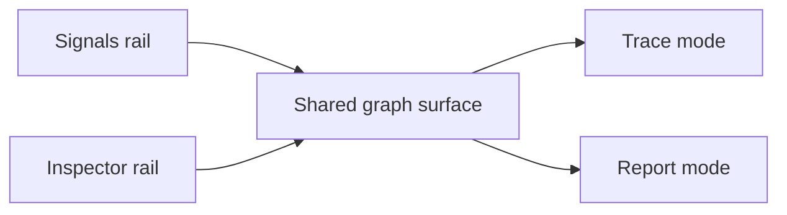

## prod_005_peaklive_graph_centric_diagnostic_workspace - PeakLive graph-centric diagnostic workspace
> Date: 2026-08-26
> Status: Settled
> Related request: `req_005_make_the_peaklive_workspace_graph_centric_and_compact`
> Related backlog: `item_029_deliver_a_compact_shared_axis_graph_workspace_and_robust_collapsed_rails`
> Related task: `task_005_implement_the_peaklive_graph_centric_compact_workspace`
> Related architecture: (none yet)
> Reminder: Update status, linked refs, scope, decisions, success signals, and open questions when you edit this doc.
> Indicators reviewed: 2026-08-26 18:38:12

# Overview
A focused redesign of the existing desktop measurement workspace. It turns selected signals into one compact graph surface with a shared time axis, fixes collapsed-side-panel affordances, and establishes a hierarchy that reserves most of the central window for live data.

# Goals
- Make live graphs the central, readable object in the workspace.
- Remove visual fragmentation from stacked plot cards, repeated time axes, and scrolling between selected signals.
- Make side-panel collapse controls compact, reliable, and discoverable.
- Keep supporting controls compact without compromising keyboard or pointer operation.

# Non-goals
- Change CAN acquisition, decoding, filters, exports, cursor calculations, or measurement mathematics.
- Implement the independently tracked Trace filter-header responsiveness work.
- Add new graph-analysis modes, floating windows, docking, or a web UI migration.
- Copy an external product's implementation or visual identity.

# Scope and guardrails
- In: scaffolded request, product, backlog, orchestration task, validation, and handoff context.
- Out: unrelated workflow docs and implementation of generated tasks.

# Key product decisions
- Use structured input as the source of truth for generated docs.
- Keep generated write paths local and repo-bounded.

# Success signals
- Generated docs pass lint and audit without broad manual rewrites.
- Context-pack output can be handed to an implementation agent directly.

# References
- Product back-reference: `item_029_deliver_a_compact_shared_axis_graph_workspace_and_robust_collapsed_rails`
- Task back-reference: `task_005_implement_the_peaklive_graph_centric_compact_workspace`
