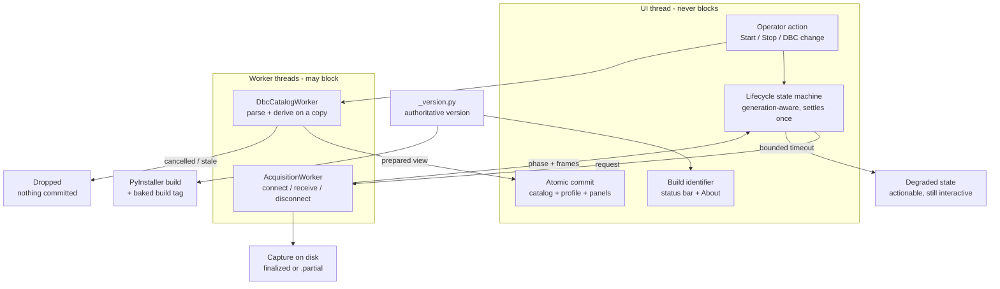

## prod_006_peaklive_responsive_runtime_and_identifiable_builds - PeakLive responsive runtime and identifiable builds
> Date: 2026-08-27
> Status: Settled
> Related request: `req_006_keep_peaklive_responsive_during_acquisition_dbc_changes_and_test_build_verification`
> Related backlog: `item_030_make_acquisition_lifecycle_operations_responsive_and_bounded`
> Related task: `task_006_deliver_responsive_peaklive_lifecycle_dbc_operations_and_build_identity`
> Related architecture: (none yet)
> Reminder: Update status, linked refs, scope, decisions, success signals, and open questions when you edit this doc.
> Indicators reviewed: 2026-08-27 14:13:53

# Overview
A reliability-focused enhancement that makes long-running CAN and DBC lifecycle work visibly asynchronous and bounded from the operator's perspective, while making every test executable easy to identify.

# Goals
- Protect the UI event loop from slow, blocked, or failing device and file operations.
- Make acquisition lifecycle state explicit, recoverable, and safe under repeated user actions.
- Make DBC catalog mutations responsive and transactionally consistent.
- Let an operator identify the exact local build under test at a glance.
- Create deterministic regression coverage for responsiveness and failure handling.

# Non-goals
- Add CAN transmission, new CAN hardware vendors, or new acquisition modes.
- Change DBC semantics, edit DBC content, or duplicate the existing DBC conflict-resolution policy.
- Add automatic updates, telemetry, network verification, or a remote build service.
- Guarantee that an external driver process always terminates; instead surface bounded, actionable application behavior when it does not.

# Scope and guardrails
- In: scaffolded request, product, backlog, orchestration task, validation, and handoff context.
- Out: unrelated workflow docs and implementation of generated tasks.

# Key product decisions
- Use structured input as the source of truth for generated docs.
- Keep generated write paths local and repo-bounded.

# Success signals
- Generated docs pass lint and audit without broad manual rewrites.
- Context-pack output can be handed to an implementation agent directly.

# References
- Product back-reference: `item_030_make_acquisition_lifecycle_operations_responsive_and_bounded`
- Task back-reference: `task_006_deliver_responsive_peaklive_lifecycle_dbc_operations_and_build_identity`
