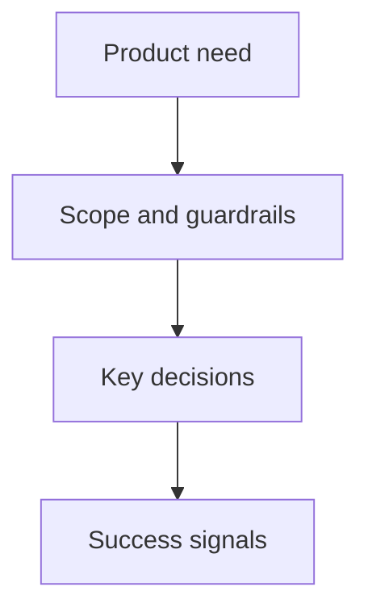

## prod_007_prevent_the_ui_from_freezing_when_stopping_a_busy_can_acquisition - Prevent the UI from freezing when stopping a busy CAN acquisition
> Date: 2026-08-28
> Status: Proposed
> Related request: `req_007_prevent_ui_freeze_when_stopping_busy_can_acquisition`
> Related backlog: `item_034_prevent_the_ui_from_freezing_when_stopping_a_busy_can_acquisition`
> Related task: task_008_prevent_the_ui_from_freezing_when_stopping_a_busy_can_acquisition
> Related architecture: (none yet)
> Reminder: Update status, linked refs, scope, decisions, success signals, and open questions when you edit this doc.
> Indicators reviewed: 2026-08-28 09:29:14

# Overview
- Ensure that an operator can stop a high-rate live CAN acquisition without the
  presentation backlog starving the desktop UI. The acquisition and recorder
  remain lossless; only superseded visual work is allowed to be coalesced.

# Goals
- Give Stop priority over queued visual frame delivery and retain a responsive
  Qt event loop while a session winds down.
- Preserve the recorder as the lossless consumer, independent of bounded trace
  and graph presentation updates.
- Make terminal lifecycle feedback observable even when an older acquisition
  generation has queued visual work.
- Prove the behavior with a deterministic, headless high-rate regression.

# Non-goals
- Do not change CAN bitrate, controller mode, receive-only operation, or PCAN
  adapter semantics.
- Do not drop frames already handed to the acquisition worker or alter ASC
  recording/finalization guarantees.
- Do not redesign the workspace, trace filtering behavior, or graph features.

# Scope and guardrails
- In: Coalesced worker-to-GUI frame delivery, generation-aware visual-update
  invalidation during Stop, lifecycle-priority handling, and burst regression
  coverage.
- Out: Hardware-driver remediation and changes to capture or recording formats.

# Key product decisions
- Treat durable acquisition/recording and visual presentation as separate
  consumers: recording is lossless, while presentation may retain only the
  newest pending work for an active generation.
- At Stop, invalidate queued presentation work from the stopping generation so
  terminal lifecycle state is not held behind obsolete renders.

# Success signals
- In the 20,000-frame synthetic burst, the Stop callback runs within one
  second of its scheduled 0.5-second request and a 10 ms UI probe continues to
  tick while shutdown reaches a terminal or documented degraded state.
- Existing normal-rate acquisition, filtering, selection, graph, recording,
  and adapter regression tests remain green.

# References
- Product back-reference: `item_034_prevent_the_ui_from_freezing_when_stopping_a_busy_can_acquisition`
- Task back-reference: (none yet)
