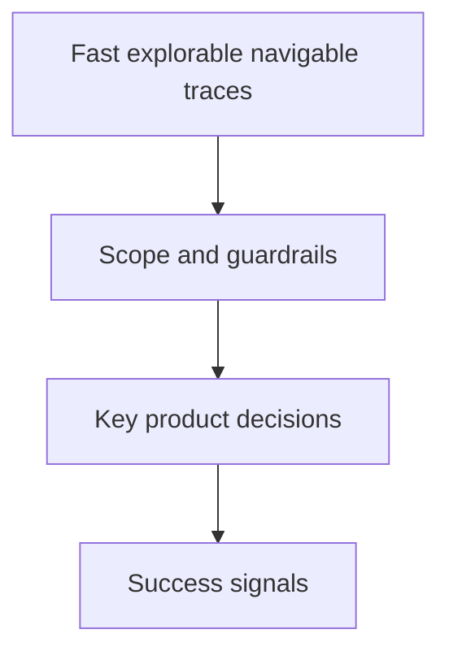

## prod_009_peaklive_fast_explorable_and_globally_navigable_traces - PeakLive fast, explorable, and globally navigable traces
> Date: 2026-08-28
> Status: Settled
> Related request: `req_009_audit_peaklive_performance_and_make_trace_signal_exploration_and_time_navigation_complete`
> Related backlog: `item_036_audit_and_optimize_the_peaklive_trace_loading_critical_path`
> Related task: `task_010_deliver_a_measured_lazy_and_globally_navigable_peaklive_trace_workspace`
> Related architecture: (none yet)
> Reminder: Update status, linked refs, scope, decisions, success signals, and open questions when you edit this doc.
> Indicators reviewed: 2026-08-28 20:14:24

# Overview
A performance and analysis-navigation improvement that makes large trace loading measurable and responsive, allows signal exploration after load without reparsing, and gives analysts a truthful full-capture time view for replay and acquisition.

# Goals
- Measure and remove the dominant costs in trace loading and presentation while preserving bounded behavior.
- Make all supported decoded signals available on demand from one loaded session.
- Show the complete replay time extent by default and maintain a zero-based expanding global axis during acquisition.
- Keep cancellation, replacement, filtering, reporting, and bounded retention explicit and reliable.

# Non-goals
- Add binary capture, CAN FD, J1939 semantic, or hardware-driver features.
- Retain unbounded raw frames or decoded samples solely to simplify later navigation.
- Change DBC signal semantics or silently discard unsupported and malformed records.
- Force one visualization mode on operators who explicitly choose tail-follow navigation.

# Scope and guardrails
- In: scaffolded request, product, backlog, orchestration task, validation, and handoff context.
- Out: unrelated workflow docs and implementation of generated tasks.

# Key product decisions
- Use structured input as the source of truth for generated docs.
- Keep generated write paths local and repo-bounded.

# Success signals
- Generated docs pass lint and audit without broad manual rewrites.
- Context-pack output can be handed to an implementation agent directly.

# References
- Product back-reference: `item_036_audit_and_optimize_the_peaklive_trace_loading_critical_path`
- Task back-reference: `task_010_deliver_a_measured_lazy_and_globally_navigable_peaklive_trace_workspace`
