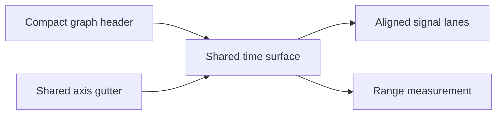

## prod_010_peaklive_compact_aligned_measurement_graphs - PeakLive compact aligned measurement graphs
> Date: 2026-08-31
> Status: Proposed
> Related request: `req_010_refine_the_peaklive_graph_header_axis_alignment_and_scrolling_behaviour`
> Related backlog: `item_039_deliver_a_compact_aligned_non_scrolling_peaklive_graph_surface`
> Related task: `task_011_implement_the_compact_aligned_peaklive_graph_presentation`
> Related architecture: (none yet)
> Reminder: Update status, linked refs, scope, decisions, success signals, and open questions when you edit this doc.
> Indicators reviewed: 2026-08-31 15:50:43

# Overview
A precision refinement of the native graph workspace that turns its controls and stacked signal lanes into one compact, aligned measurement surface. It retains the existing graph-centric interaction model while making visual hierarchy, axis geometry, and scrolling behaviour predictable.

# Goals
- Make the full graph command set immediately available in a compact single-row header.
- Make stacked signal lanes share a visibly exact time geometry.
- Eliminate scrolling and whitespace artefacts that interrupt trace comparison.
- Preserve current measurement and navigation behaviour while improving presentation quality.

# Non-goals
- Copy an external application's branding, source code, or complete visual identity.
- Change CAN acquisition, decoding, filtering, exports, signal values, or measurement calculations.
- Add new graph analysis modes, multi-window docking, or a web user interface.
- Redesign Trace filtering or unrelated side-panel workflows.

# Scope and guardrails
- In: scaffolded request, product, backlog, orchestration task, validation, and handoff context.
- Out: unrelated workflow docs and implementation of generated tasks.

# Key product decisions
- Use structured input as the source of truth for generated docs.
- Keep generated write paths local and repo-bounded.

# Success signals
- Generated docs pass lint and audit without broad manual rewrites.
- Context-pack output can be handed to an implementation agent directly.

# References
- Product back-reference: `req_010_refine_the_peaklive_graph_header_axis_alignment_and_scrolling_behaviour`
- Task back-reference: `task_011_implement_the_compact_aligned_peaklive_graph_presentation`
