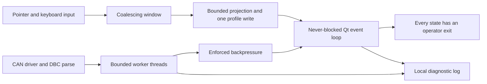

## prod_011_peaklive_freeze_free_and_self_diagnosing_workstation - PeakLive freeze-free and self-diagnosing workstation
> Date: 2026-09-01
> Status: Proposed
> Related request: `req_011_eliminate_the_remaining_peaklive_freezes_dead_ends_and_silent_failures_found_by_the_ui_thread_audit`
> Related backlog: `item_040_give_the_application_a_diagnostic_voice_before_changing_its_behaviour`, `item_041_remove_the_unbounded_and_serialized_ui_thread_waits`, `item_042_give_the_acquisition_timeout_an_exit`, `item_043_make_the_replay_and_ingestion_bounds_hold_in_practice`, `item_044_coalesce_the_work_driven_by_continuous_pointer_and_keyboard_input`, `item_045_make_export_and_recording_thread_safe_and_bounded`
> Related task: `task_012_deliver_a_freeze_free_self_diagnosing_peaklive_runtime`
> Related architecture: (none yet)
> Reminder: Update status, linked refs, scope, decisions, success signals, and open questions when you edit this doc.

# Overview
A reliability enhancement that closes the remaining gaps between PeakLive's responsive-ingestion design and its runtime behaviour: no unbounded wait on the UI thread, no application state without an exit, no failure without a trace, and no continuous input paying for disk or statistics work.

# Goals
- Guarantee that the Qt event loop is never stopped without a bound, on any operator-reachable path.
- Guarantee that every state the application can enter has an operator action that leaves it.
- Make a freeze or a half-applied state diagnosable after the fact, from the operator's machine, without reproducing it.
- Make the ingestion and input bounds the design already intends hold in practice, and assert them by count rather than by wall time.
- Remove the cross-thread data races and worker ownership gaps that turn a slow path into a crash.

# Non-goals
- Add CAN transmission, new adapter vendors, or new acquisition modes.
- Change capture format semantics, decode rules, DBC conflict policy, or the bounded retention capacities.
- Add telemetry, crash reporting to a remote service, automatic updates, or any network dependency; the diagnostic log stays local.
- Guarantee that an external CAN driver always returns; the scope is bounded, actionable, documented application behaviour when it does not.
- Rewrite the trace table onto a model/view architecture; the scope is bounding the cost of the current projection, not replacing it.

# Scope and guardrails
- In: scaffolded request, product, backlog, orchestration task, validation, and handoff context.
- Out: unrelated workflow docs and implementation of generated tasks.

# Key product decisions
- Use structured input as the source of truth for generated docs.
- Keep generated write paths local and repo-bounded.

# Success signals
- Generated docs pass lint and audit without broad manual rewrites.
- Context-pack output can be handed to an implementation agent directly.

# References
- Product back-reference: `req_011_eliminate_the_remaining_peaklive_freezes_dead_ends_and_silent_failures_found_by_the_ui_thread_audit`
- Task back-reference: `task_012_deliver_a_freeze_free_self_diagnosing_peaklive_runtime`
