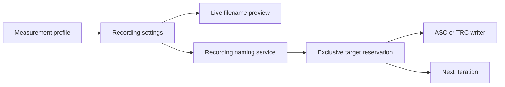

## prod_013_peaklive_configurable_and_collision_safe_acquisition_recording - PeakLive configurable and collision-safe acquisition recording
> Date: 2026-09-03
> Status: Proposed
> Related request: `req_013_add_canalyzer_style_recording_configuration_and_collision_safe_acquisition_naming_to_peaklive`
> Related backlog: `item_048_deliver_a_deterministic_recording_naming_and_reservation_service`, `item_049_expose_profile_recording_settings_with_live_filename_preview`
> Related task: `task_014_implement_configurable_collision_safe_peaklive_recording_names`
> Related architecture: (none yet)
> Reminder: Update status, linked refs, scope, decisions, success signals, and open questions when you edit this doc.
> Indicators reviewed: 2026-09-03 10:37:17

# Overview
PeakLive lets an operator configure a profile's recording destination and a readable semi-automatic filename while reliably reserving the first available iteration before capture evidence is written.

# Goals
- Make recording configuration visible, understandable, and profile-scoped.
- Produce deterministic, readable filenames from a limited documented placeholder language.
- Guarantee that starting a recording does not overwrite an earlier or concurrently reserved acquisition.
- Keep naming policy independent from Qt and from the capture writer.

# Non-goals
- Add new CAN capture formats, transmission, cloud destinations, scheduled recording, or a file browser for prior captures.
- Change raw-frame capture completeness, rotation byte thresholds, CAN decoding, replay, or export semantics.
- Support arbitrary template expressions, arbitrary filesystem paths embedded in templates, or user-defined scripting.
- Guarantee recovery of a capture whose process and storage both failed before durable data was written.

# Scope and guardrails
- In: scaffolded request, product, backlog, orchestration task, validation, and handoff context.
- Out: unrelated workflow docs and implementation of generated tasks.

# Key product decisions
- Use structured input as the source of truth for generated docs.
- Keep generated write paths local and repo-bounded.

# Success signals
- Generated docs pass lint and audit without broad manual rewrites.
- Context-pack output can be handed to an implementation agent directly.

# References
- Product back-reference: `req_013_add_canalyzer_style_recording_configuration_and_collision_safe_acquisition_naming_to_peaklive`
- Task back-reference: `task_014_implement_configurable_collision_safe_peaklive_recording_names`
