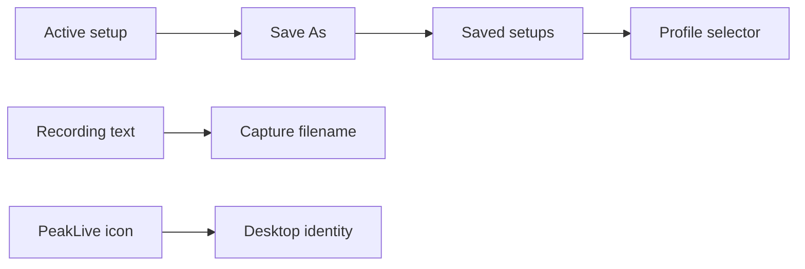

## prod_014_peaklive_reusable_measurement_setups_and_identifiable_recording_workspace - PeakLive reusable measurement setups and identifiable recording workspace
> Date: 2026-09-03
> Status: Proposed
> Related request: `req_014_manage_reusable_peaklive_measurement_setups_recording_text_and_desktop_application_identity`
> Related backlog: `item_050_add_persistent_save_as_and_loading_workflows_for_independent_measurement_setups`, `item_051_add_a_safe_profile_scoped_recording_text_placeholder_and_editor_field`, `item_052_create_and_package_the_peaklive_application_icon`
> Related task: `task_015_deliver_reusable_measurement_setups_recording_text_and_application_icon_identity`
> Related architecture: (none yet)
> Reminder: Update status, linked refs, scope, decisions, success signals, and open questions when you edit this doc.

# Overview
Make PeakLive practical for repeated bench configurations: an operator can preserve a complete measurement setup as a named independent copy, load it later, add a meaningful text label to capture filenames, and recognize the application immediately in the desktop environment.

# Goals
- Provide a safe, explicit Save As workflow for reusable measurement setups.
- Define exactly what configuration a setup owns and ensure all supported fields round-trip independently.
- Make capture names distinguishable with a safe operator-provided text component.
- Establish a coherent, packaged application icon for runtime and Windows distribution.

# Non-goals
- Cloud synchronisation, collaboration, version history, or sharing setups between machines in this delivery.
- Embedding, copying, or distributing DBC source files inside a setup.
- Deleting, renaming, merging, or importing/exporting setup files unless separately scoped.
- Changing CAN receive/transmit behavior, capture ordering, ASC/TRC semantics, rotation thresholds, or overwrite protection.
- A broad application rebrand, installer redesign, tray integration, or operating-system-specific icon set beyond the owned PeakLive application icon and current Windows artifact.

# Scope and guardrails
- In: scaffolded request, product, backlog, orchestration task, validation, and handoff context.
- Out: unrelated workflow docs and implementation of generated tasks.

# Key product decisions
- Use structured input as the source of truth for generated docs.
- Keep generated write paths local and repo-bounded.

# Success signals
- Generated docs pass lint and audit without broad manual rewrites.
- Context-pack output can be handed to an implementation agent directly.

# References
- Product back-reference: `req_014_manage_reusable_peaklive_measurement_setups_recording_text_and_desktop_application_identity`
- Task back-reference: `task_015_deliver_reusable_measurement_setups_recording_text_and_application_icon_identity`
