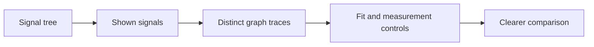

## prod_015_peaklive_unmistakable_graph_comparison_and_signal_controls - PeakLive unmistakable graph comparison and signal controls
> Date: 2026-09-03
> Status: Proposed
> Related request: `req_015_make_peaklive_graph_comparison_and_signal_controls_unmistakably_legible`
> Related backlog: `item_053_deliver_distinguishable_graph_traces_and_explicit_graph_fitting_controls`, `item_054_deliver_a_compact_high_contrast_signals_tree_and_explicit_drop_down_affordances`
> Related task: `task_016_implement_legible_peaklive_graph_comparison_and_signal_controls`
> Related architecture: (none yet)
> Reminder: Update status, linked refs, scope, decisions, success signals, and open questions when you edit this doc.

# Overview
A precision usability pass for the diagnostic workspace: simultaneous graphs become easy to distinguish, the Signals tree prioritizes names and readable icon actions, and graph controls make fitting and cursor-data visibility explicit without changing CAN analysis semantics.

# Goals
- Reduce operator ambiguity when comparing several signals or navigating a nested DBC tree.
- Make stateful controls readable, compact, accessible, and consistent with the dark instrument theme.
- Preserve a time zoom while fitting amplitudes, and let operators suppress measurement data when it obscures the graph workspace.
- Keep the graph and trace operating surface dense without hiding essential actions.

# Non-goals
- Change CAN acquisition, DBC decoding, retained data, cursor mathematics, measurement formulas, or export content.
- Replace the DBC/message/signal tree with a different navigation model or add recording filters.
- Introduce a user-editable colour palette, per-signal manual colour picking, or a full application rebrand unless separately approved.
- Change acquisition lifecycle semantics while relocating the existing Play/Stop controls into the confirmed graph/trace header.

# Scope and guardrails
- In: scaffolded request, product, backlog, orchestration task, validation, and handoff context.
- Out: unrelated workflow docs and implementation of generated tasks.

# Key product decisions
- Use structured input as the source of truth for generated docs.
- Keep generated write paths local and repo-bounded.
- Keep A/B vertical cursor lines visible whenever cursor measurement values are hidden.
- Persist cursor-measurement-value visibility in the active measurement profile, with a backward-compatible visible default.
- Put the Graphs/Trace title, Graphs-only selection, no-sample state, zoom/resize controls, Play/Stop, cursor actions, and cursor timings on one graph/trace header line.

# Success signals
- Generated docs pass lint and audit without broad manual rewrites.
- Context-pack output can be handed to an implementation agent directly.

# References
- Product back-reference: `req_015_make_peaklive_graph_comparison_and_signal_controls_unmistakably_legible`
- Task back-reference: `task_016_implement_legible_peaklive_graph_comparison_and_signal_controls`
