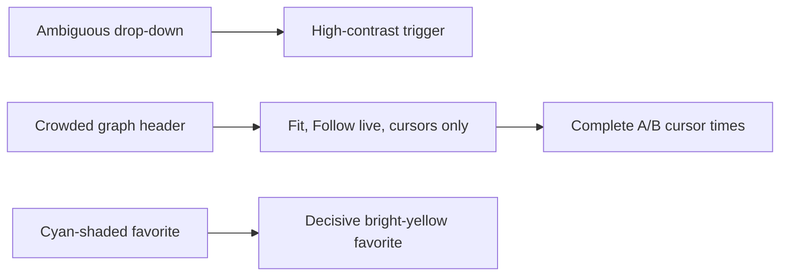

## prod_016_peaklive_compact_graph_controls_and_unmistakable_signal_states - PeakLive compact graph controls and unmistakable signal states
> Date: 2026-09-03
> Status: Settled
> Related request: `req_016_compact_peaklive_graph_controls_and_unmistakable_signal_states`
> Related backlog: `item_055_simplify_and_make_the_peaklive_graph_command_row_legible`
> Related task: `task_017_implement_compact_graph_controls_and_unmistakable_signal_states`
> Related architecture: (none yet)
> Reminder: Update status, linked refs, scope, decisions, success signals, and open questions when you edit this doc.
> Indicators reviewed: 2026-09-04 00:32:09

# Overview
A focused visual cleanup makes every selector look intentional, leaves the graph header to the controls operators actually use, gives both cursor times enough room, and makes signal visibility and favorites obvious at a glance.

# Goals
- Eliminate ambiguous drop-down and signal-state affordances in the dark workspace.
- Make the graph command row calmer and readable without sacrificing fit, cursor, or Follow live operation.
- Prioritize simultaneous complete A/B cursor-time visibility over redundant window-status information.
- Preserve familiar unselected favorite styling while making selected state decisive.

# Non-goals
- Change CAN acquisition, decoding, retained samples, export data, cursor mathematics, or measurement formulas.
- Add new graph navigation modes, manual colour customization, or a global visual redesign.
- Redesign signal-tree hierarchy, change profile schema, or alter what shown/favorite state means.
- Remove mouse-wheel, pan, or existing non-button graph navigation unless a focused regression proves it is coupled to the removed buttons.

# Scope and guardrails
- In: scaffolded request, product, backlog, orchestration task, validation, and handoff context.
- Out: unrelated workflow docs and implementation of generated tasks.

# Key product decisions
- Use structured input as the source of truth for generated docs.
- Keep generated write paths local and repo-bounded.

# Success signals
- Generated docs pass lint and audit without broad manual rewrites.
- Context-pack output can be handed to an implementation agent directly.

# References
- Product back-reference: `item_055_simplify_and_make_the_peaklive_graph_command_row_legible`
- Task back-reference: `task_017_implement_compact_graph_controls_and_unmistakable_signal_states`
