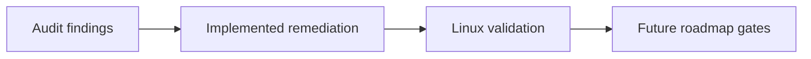

## prod_017_peaklive_audit_closure_and_future_ready_can_workstation_roadmap - PeakLive audit closure and future-ready CAN workstation roadmap
> Date: 2026-09-04
> Status: Settled
> Related request: `req_017_close_the_september_2026_peaklive_audit_and_deliver_its_future_ready_roadmap`
> Related backlog: `item_057_bound_recording_name_reservation_and_cancel_it_safely`
> Related task: `task_018_deliver_every_september_2026_audit_correction_and_future_roadmap_milestone`
> Related architecture: (none yet)
> Reminder: Update status, linked refs, scope, decisions, success signals, and open questions when you edit this doc.
> Indicators reviewed: 2026-09-05 10:41:26

# Overview
A complete, evidence-driven remediation and delivery roadmap that makes PeakLive correct under load, resilient under failure, legible as a professional CAN diagnostic tool, and deliberately extensible toward new formats, adapters, and later CAN transmission.

# Goals
- Eliminate the audit's P0 freezes, crashes, silent data loss, and false-success outcomes.
- Preserve exhaustive measurement facts while bounding visual work and continuous-input work.
- Make the most important diagnostic workflows discoverable, fast, and visually unambiguous.
- Replace accidental architecture constraints with tested extension seams and an honest capability roadmap.
- Keep implementation evidence current rather than relying on historical Done status.

# Non-goals
- Guarantee Windows or physical-PCAN certification in this delivery; those remain tracked acceptance work after Linux proof.
- Ship CAN transmission before its separate product and safety decision chain is approved.
- Add remote telemetry, cloud services, or automatic software updates.
- Perform a wholesale rewrite where a bounded, tested correction is sufficient.

# Scope and guardrails
- In: scaffolded request, product, backlog, orchestration task, validation, and handoff context.
- Out: unrelated workflow docs and implementation of generated tasks.

# Key product decisions
- Use structured input as the source of truth for generated docs.
- Keep generated write paths local and repo-bounded.

# Success signals
- Generated docs pass lint and audit without broad manual rewrites.
- Context-pack output can be handed to an implementation agent directly.

## Future CAN transmit gate
CAN transmission remains excluded from the delivered product. A future transmit
chain may be promoted only after: (1) an adapter capability contract is landed,
(2) receive-only and passive-mode regressions pass on supported hardware,
(3) a safety review approves frame authoring, rate limits, and an operator
confirmation flow, and (4) a dedicated request/backlog/task chain is promoted.
No transmit control may be added as an incidental part of receive, replay, or
roadmap work.

# References
- Product back-reference: `item_057_bound_recording_name_reservation_and_cancel_it_safely`
- Task back-reference: `task_018_deliver_every_september_2026_audit_correction_and_future_roadmap_milestone`
