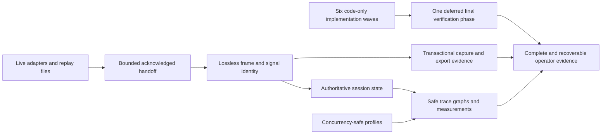

## prod_018_peaklive_trustworthy_measurement_identity_and_recoverable_local_evidence - PeakLive trustworthy measurement identity and recoverable local evidence
> Date: 2026-09-07
> Status: Settled
> Related request: `req_019_eliminate_peaklive_second_pass_integrity_identity_and_recovery_gaps`
> Related backlog: `item_098_drain_live_acquisition_completely_through_a_bounded_authoritative_handoff`
> Related task: `task_019_implement_every_second_pass_peaklive_integrity_and_recovery_correction`
> Related architecture: (none yet)
> Reminder: Update status, linked refs, scope, decisions, success signals, and open questions when you edit this doc.
> Indicators reviewed: 2026-09-07 15:06:53

# Overview
PeakLive preserves every accepted measurement record and its identity across live acquisition, replay, decoding, visualization, persistence, and local output, while failures remain explicit and prior evidence remains recoverable.

# Goals
- Keep durable capture, replay results, session facts, retained frames, decoded series, and operator-visible status mutually consistent.
- Prevent cancellation, collision, rotation, or concurrent application instances from silently deleting or overwriting local evidence and configuration.
- Represent CAN direction, remote DLC, identifier format, and decoded-signal provenance without ambiguity.
- Bound live and replay handoffs without converting overload into silent loss or false success.
- Deliver one end-of-development verification phase covering all integrity scenarios after implementation is complete.

# Non-goals
- Add new capture formats, new hardware adapters, frame transmission, cloud storage, or remote collaboration.
- Change series, frame-cache, or trace retention capacities except where an upstream handoff requires an explicit bound.
- Redesign unrelated graph controls, visual styling, workspace layout, or the active graph-legibility work.
- Claim Windows or live-hardware certification from Linux/offscreen automated evidence.
- Run tests repeatedly after each implementation slice; validation is intentionally deferred until all development slices are complete.

# Scope and guardrails
- In: scaffolded request, product, backlog, orchestration task, validation, and handoff context.
- Out: unrelated workflow docs and implementation of generated tasks.

# Key product decisions
- Authoritative ingestion and bounded presentation are separate responsibilities; accepted records cannot disappear merely to protect UI responsiveness.
- Completion is asserted only after acknowledged delivery, and every cancellation, replacement, overload, parser, decode, or publication failure remains explicit.
- Final local output is published transactionally from operation-owned temporary artifacts, and all related capture/sidecar names share one collision domain.
- CAN frame and decoded-signal keys carry machine-stable provenance independently of concise operator labels.
- Profile concurrency produces a deterministic merge or visible stale-write rejection, never silent last-writer data loss.
- Tests are neither authored nor executed incrementally during the six implementation waves; regression authoring and all automated gates occur together after development is complete.

# Success signals
- A stopped live session and a successful replay contain every accepted source frame exactly once while overload remains bounded.
- Cancellation, rotation, collision, concurrent instances, remote frames, and identity collisions preserve prior evidence and expose truthful outcomes.
- Operators can distinguish same-number CAN identities and same-name decoded signals throughout UI, persistence, analysis, and output.
- The final deferred regression matrix, full Linux/offscreen suite, lint, internationalization checks, and Logics validation pass after all implementation waves complete.

# References
- Product back-reference: `item_098_drain_live_acquisition_completely_through_a_bounded_authoritative_handoff`
- Task back-reference: `task_019_implement_every_second_pass_peaklive_integrity_and_recovery_correction`
