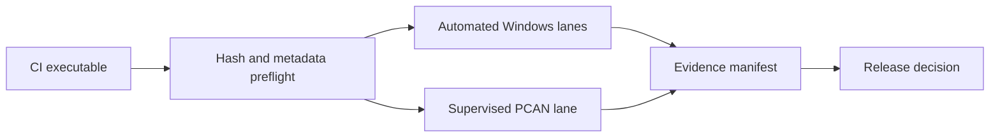

## prod_019_peaklive_windows_executable_qualification_kit - PeakLive Windows executable qualification kit
> Date: 2026-09-08
> Status: Settled
> Related request: `req_020_qualify_the_peaklive_ci_windows_executable_with_a_reproducible_functional_test_battery`
> Related backlog: `item_105_create_an_isolated_powershell_qualification_harness_for_a_ci_built_peaklive_executable`
> Related task: `task_020_deliver_the_peaklive_windows_ci_executable_qualification_battery`
> Related architecture: (none yet)
> Reminder: Update status, linked refs, scope, decisions, success signals, and open questions when you edit this doc.
> Indicators reviewed: 2026-09-08 14:14:11

# Overview
Each CI-built PeakLive Windows executable can be qualified on a clean, controlled bench through a repeatable mix of automated smoke/UI/fixture checks and safety-conscious PCAN hardware acceptance, producing local evidence that identifies the exact binary.

# Goals
- Make the executable, not merely source code, the system under test.
- Allow a developer to run deterministic non-hardware tests from PowerShell with isolated data and reusable fixtures.
- Make bench tests safe, observable, repeatable, and honest about unavailable preconditions.
- Retain enough evidence to reproduce a reported release failure without collecting customer or production CAN data.

# Non-goals
- Automating physical bus generation, PCAN driver installation, Windows installation, or a real 60-minute high-load bus when the bench cannot supply it.
- Adding transmit functionality, CAN FD, cloud reporting, telemetry, code signing, or installer technology.
- Changing PeakLive functional behaviour solely to make UI automation easier.
- Treating a test run made from source, Linux, or offscreen Qt as packaged-Windows acceptance evidence.

# Scope and guardrails
- In: scaffolded request, product, backlog, orchestration task, validation, and handoff context.
- Out: unrelated workflow docs and implementation of generated tasks.

# Key product decisions
- Use structured input as the source of truth for generated docs.
- Keep generated write paths local and repo-bounded.

# Success signals
- Generated docs pass lint and audit without broad manual rewrites.
- Context-pack output can be handed to an implementation agent directly.

# References
- Product back-reference: `item_105_create_an_isolated_powershell_qualification_harness_for_a_ci_built_peaklive_executable`
- Task back-reference: `task_020_deliver_the_peaklive_windows_ci_executable_qualification_battery`
