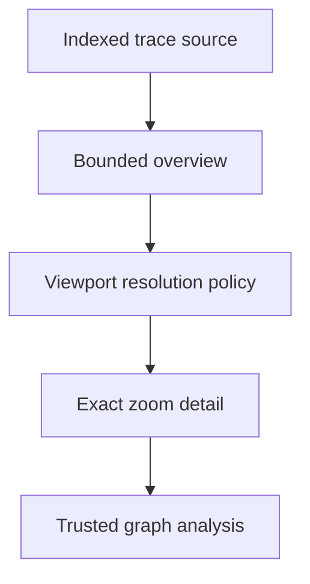

## prod_022_peaklive_multiresolution_lossless_historical_trace_detail - PeakLive multiresolution lossless historical trace detail
> Date: 2026-09-10
> Status: Settled
> Related request: `req_023_deliver_multiresolution_trace_graphs_with_precise_on_demand_zoom_detail`
> Related backlog: `item_114_create_a_bounded_indexed_historical_signal_source_for_complete_trace_overview`
> Related task: `task_023_deliver_bounded_multiresolution_overview_and_exact_zoom_detail_for_historical_traces`
> Related architecture: (none yet)
> Reminder: Update status, linked refs, scope, decisions, success signals, and open questions when you edit this doc.
> Indicators reviewed: 2026-09-10 13:19:29

# Overview
A bounded-memory trace-analysis capability that renders a fast truthful overview when zoomed out and retrieves exact decoded signal samples from the capture source when an analyst zooms in.

# Goals
- Keep complete historical signal evidence reachable from a loaded trace without keeping every raw or decoded sample in RAM.
- Provide an automatic, viewport-driven transition from representative overview data to exact source-derived detail.
- Preserve visual extrema, timestamp fidelity, UI responsiveness, lifecycle safety, and operator trust.
- Make approximation and exactness explicit in the graph experience and in downstream analytical actions.

# Non-goals
- Change CAN payload interpretation, DBC semantics, source recording, or supported capture formats.
- Promise exact detail when the source file is unavailable, modified, unsupported, or cannot be decoded with the active DBC set.
- Retain an unlimited decoded sample set, all raw frames, or one full in-memory copy per selected signal.
- Add playback simulation, trace editing, cloud storage, or hardware acquisition changes.

# Scope and guardrails
- In: scaffolded request, product, backlog, orchestration task, validation, and handoff context.
- Out: unrelated workflow docs and implementation of generated tasks.

# Key product decisions
- Use structured input as the source of truth for generated docs.
- Keep generated write paths local and repo-bounded.

# Success signals
- Generated docs pass lint and audit without broad manual rewrites.
- Context-pack output can be handed to an implementation agent directly.

# References
- Product back-reference: `item_114_create_a_bounded_indexed_historical_signal_source_for_complete_trace_overview`
- Task back-reference: `task_023_deliver_bounded_multiresolution_overview_and_exact_zoom_detail_for_historical_traces`
