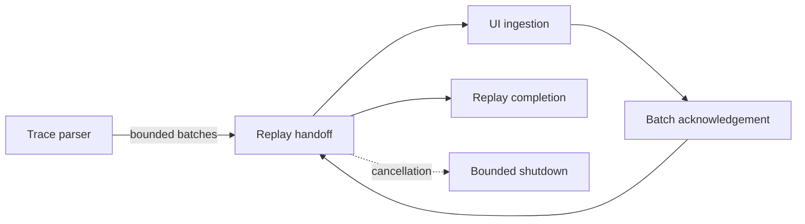

## prod_023_reliable_large_trace_replay_and_presentation_backpressure - Reliable large-trace replay and presentation backpressure
> Date: 2026-09-10
> Status: Proposed
> Related request: `req_024_prevent_long_trace_replay_from_aborting_on_false_backpressure_timeouts`
> Related backlog: `item_116_make_bounded_replay_backpressure_recoverable_and_truthful`
> Related task: `task_024_deliver_recoverable_bounded_backpressure_for_large_trace_replay`
> Related architecture: (none yet)
> Reminder: Update status, linked refs, scope, decisions, success signals, and open questions when you edit this doc.
> Indicators reviewed: 2026-09-10 16:45:16

# Overview
Make large ASC/TRC replay resilient when bounded UI presentation temporarily falls behind parsing, without unbounded memory, silent frame loss, false acquisition errors, or dishonest completion progress.

# Goals
- Finish valid large-trace replays despite transient UI presentation delays.
- Retain a hard bound on queued presentation work and a bounded shutdown path.
- Preserve lossless analysis projections and truthful progress and lifecycle states.
- Make backpressure behavior observable and regression-tested under realistic DBC and historical-store workloads.

# Non-goals
- Dropping parsed frames, weakening trace or signal retention guarantees, or bypassing the historical store.
- Adding CAN transmission, changing adapter behavior, or redesigning the graph navigation feature.
- Removing all backpressure bounds or making replay wait forever during shutdown.
- Changing the ASC/TRC formats or requiring connected hardware for validation.

# Scope and guardrails
- In: scaffolded request, product, backlog, orchestration task, validation, and handoff context.
- Out: unrelated workflow docs and implementation of generated tasks.

# Key product decisions
- Use structured input as the source of truth for generated docs.
- Keep generated write paths local and repo-bounded.

# Success signals
- Generated docs pass lint and audit without broad manual rewrites.
- Context-pack output can be handed to an implementation agent directly.

# References
- Product back-reference: `req_024_prevent_long_trace_replay_from_aborting_on_false_backpressure_timeouts`
- Task back-reference: `task_024_deliver_recoverable_bounded_backpressure_for_large_trace_replay`
