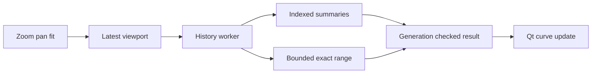

## prod_024_peaklive_responsive_and_faithful_historical_navigation_correction - PeakLive responsive and faithful historical navigation correction
> Date: 2026-09-11
> Status: Settled
> Related request: `req_025_restore_responsive_and_faithful_historical_graph_navigation`
> Related backlog: `item_117_coalesce_historical_viewport_requests_and_own_cancellable_background_reads`
> Related task: `task_025_deliver_responsive_and_faithful_historical_graph_navigation`
> Related architecture: (none yet)
> Reminder: Update status, linked refs, scope, decisions, success signals, and open questions when you edit this doc.
> Indicators reviewed: 2026-09-11 17:26:50

# Overview
Repair the delivered historical navigation regression with bounded asynchronous queries and truthful multiresolution rendering on the existing native desktop stack.

# Goals
- Make graph navigation responsive independently of total capture length after index construction.
- Keep complete capture coverage and exact local detail trustworthy.
- Qualify the actual interactive Windows delivery with measurable responsiveness and lifecycle evidence.

# Non-goals
- Rewrite the application in C++, a browser UI or a different rendering framework.
- Increase the live frame/series retention limits or load all history into RAM.
- Implement arbitrary post-load full-file decoding for previously unselected signals; expose missing historical coverage honestly.
- Redesign recording, CAN transport, DBC meanings, export formats or replay backpressure.
- Promise immediate full-detail rendering before indexing completes.

# Scope and guardrails
- In: completed replay graph scheduling, worker-owned historical queries, indexed summaries, authoritative extents, truthful detail and measurement states, and interactive qualification.
- Keep source samples lossless and live retention bounded. No raw-history scan or blocking database wait belongs in a GUI callback.
- Missing history after late signal selection remains explicit; this correction does not promise a new full-file decoding capability.

# Key product decisions
- Retain Python, PySide6, pyqtgraph and SQLite; the measured bottleneck is synchronous preparation and repeated work.
- Prefer one active and one replaceable pending historical request; preserve the last valid curve while loading.
- Precompute disk-backed resolution levels and choose detail by density and viewport pixels. Threading alone is an intermediate correction.
- Use exact historical evidence for A/B results or explicitly communicate missing/partial coverage.

# Success signals
- On a recorded Windows machine, 20 ms heartbeat lateness p95 <= 50 ms and maximum <= 150 ms over 100 mixed gestures with 1/4/8 lanes.
- Final viewport latency <= 250 ms warm and <= 1 s cold after indexing; indexing progress and cancellation are separately verified.
- Full interval coverage and late extrema survive downsampling; exact samples match the source oracle and cached results remain within 64 MiB.
- An identifiable packaged Windows replay verifies the complete interaction, supported by deterministic CI fixtures and lifecycle tests.

# References
- Product back-reference: `item_117_coalesce_historical_viewport_requests_and_own_cancellable_background_reads`
- Task back-reference: `task_025_deliver_responsive_and_faithful_historical_graph_navigation`
