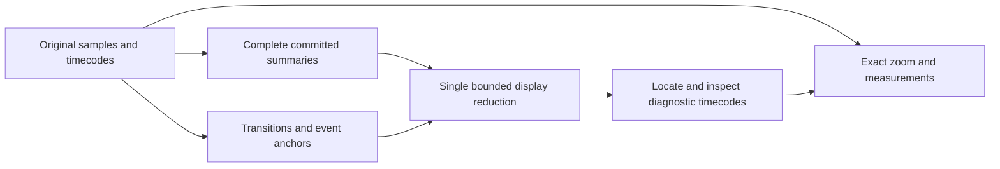

## prod_025_discoverable_rare_diagnostic_events_in_dense_historical_views - Discoverable rare diagnostic events in dense historical views
> Date: 2026-09-12
> Status: Proposed
> Related request: `req_026_restore_dense_historical_curves_and_preserve_rare_diagnostic_signal_events`
> Related backlog: `item_121_make_historical_summary_coverage_complete_and_independent_of_ingest_batches`, `item_122_render_dense_envelopes_and_rare_event_anchors_without_a_second_lossy_reduction`, `item_123_bound_viewport_scheduling_and_expose_truthful_loading_and_measurement_states`, `item_124_qualify_long_view_rare_event_fidelity_on_the_packaged_windows_application`, `item_125_make_the_application_build_identifier_selectable_and_copyable`
> Related task: `task_026_restore_dense_historical_overview_coverage_and_rare_event_discoverability`
> Related architecture: (none yet)
> Reminder: Update status, linked refs, scope, decisions, success signals, and open questions when you edit this doc.
> Indicators reviewed: 2026-09-12 16:30:43

# Overview
A corrective extension of the existing historical-navigation brief: dense curves retain truthful coverage and very short diagnostic events remain findable with exact timecodes, while the build identity can be copied for qualification.

# Goals
- Prevent zoom-out from turning populated historical lanes into blank graphs.
- Make isolated diagnostic events discoverable rather than silently losing them to display reduction.
- Keep the native desktop stack, complete source evidence and bounded responsive interaction.
- Tie operator observations to a copyable, unambiguous build identifier.

# Non-goals
- Replace the native UI with a browser/canvas or migrate the history database solely to copy the reference project.
- Promise that finite screen pixels can individually show every raw sample or every colliding event.
- Invent domain-specific analog error thresholds or infer them from private signal names.
- Implement full-file decoding for signals selected after replay; this was excluded from the previous brief and is not the reported reproduction.
- Change CAN transport, recording, DBC interpretation, export coverage or version numbering.

# Scope and guardrails
- In: complete historical summaries, faithful native rendering, discoverable short events, bounded worker/cache ownership and packaged qualification.
- Keep original sample values/timecodes and existing export coverage contracts. Late-selected full-file decoding is separate debt.
- The operator confirmed before-load selection of three signals and prioritized two-frame events over generic oscillation-density rendering.

# Key product decisions

- Retain Python, PySide6, pyqtgraph and SQLite; adapt the reference application's contracts instead of replacing the stack.
- Do not publish partial summaries as complete or apply automatic peak reduction to an already-prepared historical envelope.
- Preserve source first/min/max/last plus separate event/transition anchors. Show clusters when events collide; exact source-timecode drill-down remains available.
- Uniform stride and averaging cannot satisfy the rare-event fidelity requirement. Mandatory examples are a four-frame binary assertion after 50,000 quiet frames and a 250 A to 180 A current dip lasting 100 ms. Preserve entry/extremum/recovery anchors without requiring an amplitude threshold; generic anomaly classification is outside this correction.
- Keep the last valid display during cancellable work and reject stale request/cache generations. Use exact evidence for analytical consumers or declare the limitation.
- The canonical build identifier is read-only selectable/copyable; no version format change is needed.

# Success signals
- Three preselected curves survive both directions of wheel zoom around 650 s and full fit in the identified Windows artifact.
- One/two-frame events, including non-extreme transitions, remain discoverable through anchors or explicit clusters and exact drill-down.
- Batch partition and reset cannot change authoritative coverage. Renderer-level tests prove visible data, not just enabled options.
- Indexed queries and GUI heartbeat meet the recorded-machine budgets in the diagnosis; indexing cost is reported separately.
- Linux/Windows CI, Windows packaging, copied build identity and private-trace qualification all provide explicit evidence before closeout.

# Open questions
- Exact artifact identity is not established by the manually typed build string; copy it from the executable for qualification.
- Both discrete pulses and short analog plateau excursions are confirmed. No additional semantic answer is needed for the mandatory examples; noisy-signal activity must be grouped truthfully without claiming generic anomaly classification.
- Confirm index preparation time and temporary disk allowance from measurements before adopting a resource quota.

# References
- Product back-reference: `req_026_restore_dense_historical_curves_and_preserve_rare_diagnostic_signal_events`
- Task back-reference: `task_026_restore_dense_historical_overview_coverage_and_rare_event_discoverability`
