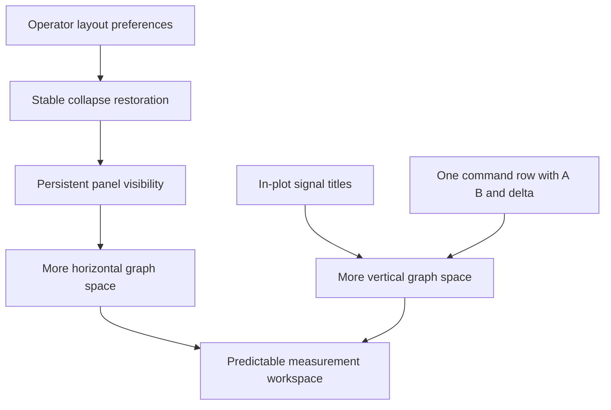

## prod_026_peaklive_predictable_and_space_efficient_measurement_workspace - PeakLive predictable and space-efficient measurement workspace
> Date: 2026-09-13
> Status: Proposed
> Related request: `req_027_restore_predictable_panel_geometry_and_reclaim_graph_workspace_space`
> Related backlog: `item_126_restore_operator_splitter_geometry_across_panel_collapse_and_expansion`, `item_127_add_persistent_full_panel_visibility_actions_to_the_view_menu`, `item_128_overlay_signal_lane_titles_inside_the_drawable_graphs`, `item_129_place_a_b_and_temporal_delta_readouts_in_the_shared_graph_command_row`
> Related task: `task_027_deliver_stable_panel_restoration_and_a_space_efficient_graph_workspace`
> Related architecture: (none yet)
> Reminder: Update status, linked refs, scope, decisions, success signals, and open questions when you edit this doc.

# Overview
Make panel geometry recoverable and eliminate avoidable rails and title/readout rows so analysts can dedicate more screen area to graph comparison without losing state or measurement controls.

# Goals
- Make repeated collapse, expansion, hiding, and restoration predictable.
- Allow a graph-focused workspace with no unused Signals or Inspector rail.
- Recover vertical plotting space through in-plot identity and one-row cursor timing.
- Preserve measurement accuracy, deliberate identity access, keyboard operation, and saved profiles.

# Non-goals
- Implement floating docks, detachable windows, or a new workspace mode system.
- Change CAN capture, decoding, historical retention, curve reduction, exports, or signal measurement mathematics.
- Add per-signal menu visibility toggles: these menu actions control the three workspace panels.
- Reintroduce removed zoom/grid/window readouts, redesign the palette, or force Inspector hidden by default.

# Scope and guardrails
- In: stable preferred panel geometry, independent persistent panel visibility, in-plot lane identity, and one command row with A/B and signed temporal delta.
- Preserve existing acquisition, selection, navigation, accessible identity, and backwards-compatible profiles.
- Use synthetic data for qualification; removed external files are not required inputs.

# Key product decisions
- Collapse leaves a recoverable rail; menu hiding removes the whole panel and remembers its collapse state.
- Graphs visibility controls the existing central Graphs/Trace/Report container.
- Keep existing visibility defaults; remember operator choices independently per profile.
- Titles overlay the ViewBox without consuming layout height or affecting data bounds.
- Delta means B minus A, computed before display rounding; all cursor times remain on the command row.
- At constrained widths, expose secondary commands in a same-row overflow while keeping times and Start/Stop visible.

# Overview diagram

# Success signals
- Unchanged-size toggle round trips recover splitter positions within 2 logical pixels, including mixed sequences.
- Hidden side panels consume no rail space and remain recoverable from View.
- Plot geometry gains the removed title and cursor-row heights at a fixed window size.
- Complete cursor times and signed delta remain readable at the specified viewports and Windows scaling factors.
- Profile round trips and graph interactions pass the linked acceptance checks.

# References
- Product back-reference: `req_027_restore_predictable_panel_geometry_and_reclaim_graph_workspace_space`
- Task back-reference: `task_027_deliver_stable_panel_restoration_and_a_space_efficient_graph_workspace`
