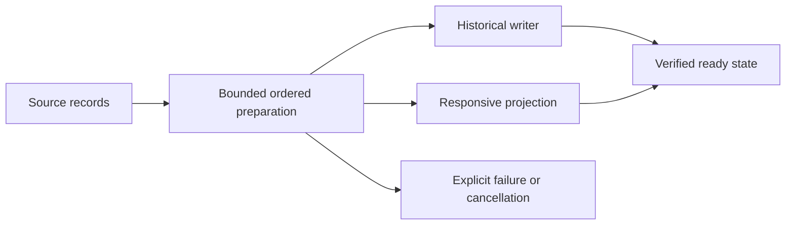

## prod_027_peaklive_responsive_and_trustworthy_long_trace_preparation - PeakLive responsive and trustworthy long trace preparation
> Date: 2026-09-13
> Status: Proposed
> Related request: `req_029_make_long_trace_loading_responsive_ordered_and_failure_explicit`
> Related backlog: `item_130_measure_and_gate_the_complete_trace_preparation_lifecycle`, `item_131_deliver_ordered_bounded_replay_batches_for_frames_and_bus_events`, `item_132_contain_historical_persistence_failures_and_settle_ingestion_ownership`, `item_133_move_and_batch_historical_trace_ingestion_behind_bounded_writer_ownership`, `item_134_qualify_typical_and_fifty_minute_trace_loading_with_existing_historical_work`
> Related task: `task_028_deliver_responsive_ordered_and_measurable_long_trace_loading`
> Related architecture: (none yet)
> Reminder: Update status, linked refs, scope, decisions, success signals, and open questions when you edit this doc.

# Overview
Make opening typical and fifty-minute captures a responsive, measurable and cancellable preparation process whose completion guarantees ordered and complete measurement evidence.

# Goals
- Keep the workspace usable and preparation state truthful regardless of source duration.
- Preserve frames, bus events, selected-signal provenance and historical fidelity.
- Expose costs and resource limits so loading performance can be improved and qualified.

# Non-goals
- Immediate loading of fifty-minute captures or an arbitrary fixed wall-clock SLA.
- A Qt rewrite, alternate database migration, parallel-agent execution, dependency overhaul or unrelated visual redesign.
- Reimplementing navigation/reconstruction acceptance already owned by the active historical task.
- Publishing private capture filenames, payloads or DBC identities.

# Scope and guardrails
- In: parsing-to-ready preparation, frame/event ordering, storage failures, historical writer ownership and representative loading evidence.
- Out: unrelated layout changes and reimplementation of already-owned historical navigation requirements.

# Key product decisions
- Typical workload: about 1.756M frames over 15m45s. Fifty minutes at comparable density is about 5.575M frames; long total loading is acceptable.
- Preserve the existing 250ms interaction objective, truthful phased progress and cancellation. Total-load latency is measured without inventing an absolute SLA.
- Keep source captures intact and label incomplete analysis explicitly after preparation failure.
- Keep SQLite unless measured evidence warrants a separate architecture decision; define single-writer and session/revision ownership before optimizing batches.
- Default signal qualification matrix: 1/8/16. Reference Windows hardware and temporary-disk cap/free-space defaults remain open; they do not prevent synthetic development.

# Success signals
- Ordered source-derived frame/event/sample counts remain exact across success, failure, cancel and replacement.
- History construction no longer blocks Qt ingestion; measured preparation milestones and queue/disk bounds are reported.
- Typical and fifty-minute qualification records identify platform, build, resource use and outstanding acceptance gaps.

# References
- Product back-reference: `req_029_make_long_trace_loading_responsive_ordered_and_failure_explicit`
- Task back-reference: `task_028_deliver_responsive_ordered_and_measurable_long_trace_loading`
