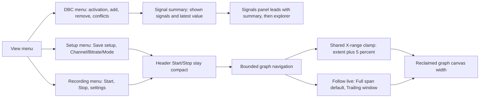

## prod_028_peaklive_focused_operator_controls_and_bounded_measurement_canvas - PeakLive focused operator controls and bounded measurement canvas
> Date: 2026-09-14
> Status: Settled
> Related request: `req_030_refine_peaklive_operator_menus_catalog_access_and_graph_navigation`
> Related backlog: `item_135_organize_recording_and_setup_commands_around_safe_profile_ownership`
> Related task: `task_029_deliver_peaklive_operator_menu_catalog_and_graph_canvas_refinement`
> Related architecture: (none yet)
> Reminder: Update status, linked refs, scope, decisions, success signals, and open questions when you edit this doc.
> Indicators reviewed: 2026-09-14 16:30:50

# Overview
Organize operator commands by Recording, Setup, DBC, and View intent while protecting safe acquisition settings, exposing live signal state, and keeping graphs focused on the time interval that was actually acquired.

# Goals
- Reduce top-bar and View-menu clutter without losing direct Start/Stop access.
- Make setup, recording, and DBC ownership obvious and profile-persistent.
- Make displayed signals and their current values visible before the explorer tree.
- Prevent graph navigation from drifting into mostly blank time and reclaim safe canvas width.

# Non-goals
- Changing adapter drivers, CAN parsing, passive-listen-only guarantees, recording data fidelity, or DBC conflict precedence.
- Adding transmit controls, live CAN hardware discovery, a new docking framework, or a new recording format.
- Changing raw/history retention policies, historical reconstruction ownership, or the semantics of Fit Y and A/B measurement values.
- Claiming that a menu hover interaction is the only path: keyboard and assistive-technology access remain required.

# Scope and guardrails
- In: scaffolded request, product, backlog, orchestration task, validation, and handoff context.
- Out: unrelated workflow docs and implementation of generated tasks.

# Key product decisions
- Use structured input as the source of truth for generated docs.
- Keep generated write paths local and repo-bounded.

# Success signals
- Generated docs pass lint and audit without broad manual rewrites.
- Context-pack output can be handed to an implementation agent directly.

# References
- Product back-reference: `item_135_organize_recording_and_setup_commands_around_safe_profile_ownership`
- Task back-reference: `task_029_deliver_peaklive_operator_menu_catalog_and_graph_canvas_refinement`
