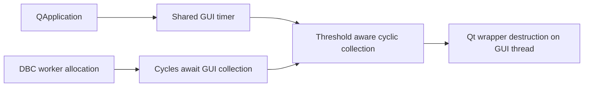

## prod_029_peaklive_gui_owned_cyclic_memory_reclamation - PeakLive GUI-owned cyclic memory reclamation
> Date: 2026-09-14
> Status: Proposed
> Related request: `req_031_prevent_qt_destruction_deadlocks_during_background_python_allocation`
> Related backlog: `item_138_own_cyclic_garbage_collection_on_the_qapplication_thread`
> Related task: `task_030_eliminate_the_qt_python_garbage_collection_lock_inversion`
> Related architecture: (none yet)
> Reminder: Update status, linked refs, scope, decisions, success signals, and open questions when you edit this doc.
> Indicators reviewed: 2026-09-14 18:12:04

# Overview
Prevent native Qt/Python lock inversion without moving DBC parsing back to the UI thread.

# Goals
- Retain responsive background workers and reclaim unreachable cycles on the GUI thread.

# Non-goals
- Change decoding results, acquisition ownership, or the user interface.

# Scope and guardrails
- In: QApplication-owned cyclic collection, startup ordering, lifetime restoration, and thread-ownership regression coverage.
- Out: parser semantics, explicit third-party gc.collect calls, and non-cyclic reference-counted destruction.

# Key product decisions
- Disable automatic cyclic collection before window workers start and schedule threshold-aware collection on the GUI event loop once per second.
- Share one timer across windows and restore the prior automatic-GC setting when QApplication is destroyed.

# Success signals
- Worker allocation cannot reclaim GUI-owned cycles; the destruction-thread regression passes.
- Full Linux and relevant Windows tests complete without the reproduced deadlock; Ruff passes.

# Runtime ownership

# References
- Product back-reference: `req_031_prevent_qt_destruction_deadlocks_during_background_python_allocation`
- Task back-reference: `task_030_eliminate_the_qt_python_garbage_collection_lock_inversion`
