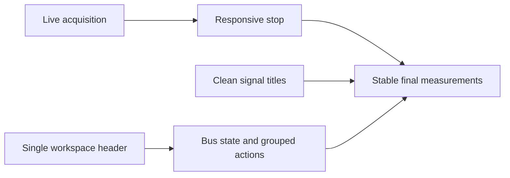

## prod_030_peaklive_responsive_stop_and_readable_measurement_controls - PeakLive responsive stop and readable measurement controls
> Date: 2026-09-16
> Status: Settled
> Related request: `req_032_restore_responsive_acquisition_stop_and_polish_the_measurement_workspace`
> Related backlog: `item_139_diagnose_and_repair_acquisition_stop_stalls_with_follow_live`
> Related task: `task_031_deliver_responsive_stop_and_polished_measurement_workspace_controls`
> Related architecture: (none yet)
> Reminder: Update status, linked refs, scope, decisions, success signals, and open questions when you edit this doc.
> Indicators reviewed: 2026-09-16 15:24:02

# Overview
Make stopping a live acquisition trustworthy and keep the analysis workspace compact, legible and consistent after menu consolidation.

# Goals
- Keep the GUI responsive throughout stop: finish in less than 3 seconds or present explicit saving/finalization progress by 3 seconds, with initial feedback within 200 ms.
- Show clean signal titles while preserving exact measurement identity.
- Reclaim the redundant setup row and group coherent header controls around acquisition, navigation and measurement.

# Non-goals
- Changing CAN decode semantics, data retention policy, recording formats or passive-listen-only behavior.
- Redesigning the whole application, replacing the plotting library or adding new navigation modes.
- Removing technical provenance from diagnostics or changing A/B and Fit computation semantics.

# Scope and guardrails
- In: measured stop responsiveness, clean measurement titles, removal of the redundant profile row, shared header bus state, action grouping and icon consistency.
- Preserve accepted acquisition data, recording completion, safe restart gating, canonical signal identities and existing navigation semantics.

# Key product decisions
- Treat Follow live as a reproduction variable until diagnostic evidence identifies the stop bottleneck.
- Prioritize the stop repair before the three Medium-priority presentation slices.
- Keep acquisition, navigation and cursor actions in distinct groups on one header line; preserve remaining unique profile commands in the top menus.
- Use reusable vector/Qt icons with a shared sizing contract and distinct Play and Follow live meanings.

- Longer finalization must expose an actual phase and honest progress/activity by 3 seconds; a popup must not block event processing or disguise a hung worker.

# Success signals
- Complete in less than 3 seconds or show explicit saving/finalization progress by 3 seconds; a delayed-over-30-second test remains responsive and ends with success or a surfaced failure.
- On the documented stress fixture, Stop feedback appears within 200 ms and the GUI heartbeat gap remains at most 250 ms throughout shutdown.
- A/B measurement titles contain no technical suffix, while colliding display names retain distinct correct values and inspectable provenance.
- The redundant profile row consumes no space; bus status and all seven requested primary actions remain visible on one header line at supported window sizes.
- Before/after diagnostic results, regression tests and visual review establish delivery evidence.

# Product overview diagram

# References
- Product back-reference: `item_139_diagnose_and_repair_acquisition_stop_stalls_with_follow_live`
- Task back-reference: `task_031_deliver_responsive_stop_and_polished_measurement_workspace_controls`
