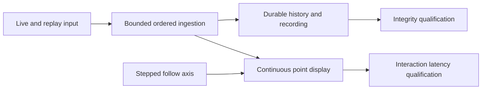

## prod_031_responsive_live_graph_following_and_lossless_replay_presentation - Responsive live graph following and lossless replay presentation
> Date: 2026-09-17
> Status: Proposed
> Related request: `req_034_restore_application_responsiveness_with_follow_live_and_nonblocking_replay_history`
> Related backlog: `item_143_complete_nonblocking_ordered_replay_admission_to_historical_persistence`, `item_144_bound_live_follow_rendering_and_qualify_a_thirty_second_axis_look_ahead`, `item_145_qualify_whole_application_follow_and_replay_responsiveness_on_windows`
> Related task: `task_032_deliver_responsive_follow_live_and_complete_the_deferred_replay_handoff`
> Related architecture: (none yet)
> Reminder: Update status, linked refs, scope, decisions, success signals, and open questions when you edit this doc.

# Overview
Keep the whole workstation interactive while following live curves or loading dense traces, combining the deferred replay handoff fix with a measured automatic-axis policy that keeps new data visible.

# Goals
- Maintain bounded operator interaction latency throughout acquisition, replay and finalization.
- Use a 30-second look-ahead axis when proven effective, preserving continuous observation of incoming points.
- Preserve every accepted record and honest historical, measurement and completion semantics.
- Qualify the real user symptom with reproducible timings and explicit platform limits.

# Non-goals
- Reimplementing the already delivered workspace cosmetics or acquisition Stop fix.
- Predicting future signal values, delaying all display updates by 30 seconds, or changing recorded timestamps.
- Raising performance budgets, dropping retained data, removing Follow live or rewriting unrelated adapters, decoding or storage formats.
- Introducing a new public configuration surface unless diagnosis establishes a product need.

# Scope and guardrails
- In: nonblocking replay admission, measured live-follow rendering and axis policy, data integrity and sustained Windows qualification.
- Out: unrelated cosmetics, adapter behavior, storage formats and relaxed performance budgets.

# Key product decisions
- Prioritize the reported six-curve full-extent live session on build v0.1.2+b202609161508; the first click reveals poor responsiveness with or without the measurement table.
- The operator confirms continuously updated points with an axis that advances in 30-second steps when proven effective. Blank future space represents no measured values.
- Preserve a short trailing window's width and reduce its advance. The proposed engineering cap is min(30 seconds, one quarter of its span).
- Preserve the entire deferred replay scope from req_033. Data ingestion, display cadence and automatic axis movement have separate responsibilities.

# Success signals
- Input feedback within 200 ms, maximum 50 ms-heartbeat gap within 250 ms, and incoming-point display age within 500 ms at the recorded supported workload.
- At least five minutes of sustained acquisition cover ten real 30-second boundaries without latency spikes, data loss or unbounded background work.
- Replay meets unchanged queue_wait budgets with exact ordered records and truthful durable completion; hosted and packaged Windows evidence supports qualification.

# Open questions and delivery gates
- Nonblocking reproduction details: recording state, OS/hardware, traffic rate, acquisition age before the first click and the effect of disabling Follow remain unconfirmed.
- The optimal axis cadence and exact short-window cap are measurement-dependent engineering choices; use the documented defaults for the prototype.
- Packaged/operator confirmation and demonstrated latency/data integrity are closeout gates. Missing evidence must remain visible and must not be presented as passing.

# References
- Product back-reference: `req_034_restore_application_responsiveness_with_follow_live_and_nonblocking_replay_history`
- Task back-reference: `task_032_deliver_responsive_follow_live_and_complete_the_deferred_replay_handoff`
