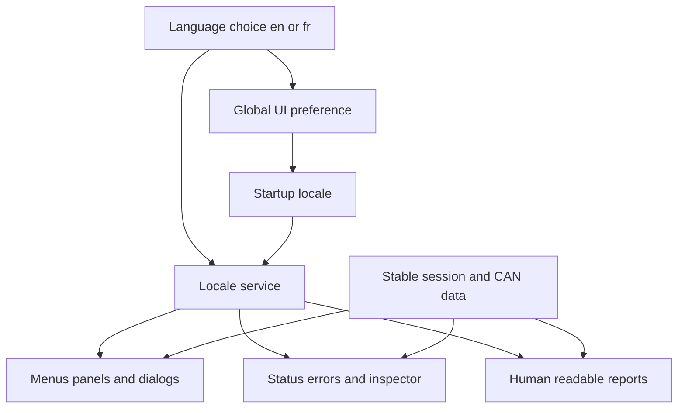

## prod_032_peaklive_french_and_english_operator_experience - PeakLive French and English operator experience
> Date: 2026-09-21
> Status: Settled
> Related request: `req_035_add_persistent_french_and_english_language_selection_across_peaklive`
> Related backlog: `item_146_establish_bilingual_catalogs_and_an_application_scoped_locale_preference`
> Related task: `task_033_deliver_complete_persistent_french_and_english_language_switching_in_peaklive`
> Related architecture: (none yet)
> Reminder: Update status, linked refs, scope, decisions, success signals, and open questions when you edit this doc.
> Indicators reviewed: 2026-09-21 16:04:44

# Overview
Offer a complete, persistent French or English interface with immediate state-preserving language changes, while keeping CAN data, operator content and interchange formats independent of presentation language.

# Goals
- Give French-speaking and English-speaking operators an equally complete workflow from setup to analysis and human-readable reporting.
- Make language discoverable under Setup and independent of vehicle or measurement profiles.
- Extend the existing semantic-key translation mechanism with complete catalogs and a controlled retranslation lifecycle.
- Prove that changing presentation language cannot disturb a running capture or silently alter data and exports.

# Non-goals
- Implementing a game, translating repository source code, or translating every developer document.
- Adding languages beyond French and English, OS-driven automatic locale selection, remote translation services or account synchronization.
- Translating operator-authored text, DBC names and enum values, paths, raw driver diagnostics or machine-readable recording/export fields.
- Changing unit systems, decimal separators, date/time formats, numeric algorithms, CAN drivers or recording semantics.
- Adding signal aliases such as those used only for README screenshots, or changing the operating system language.
- Starting implementation or claiming delivery evidence during corpus creation.

# Scope and guardrails
- In: a French/English language choice, complete catalogs, global local persistence, immediate in-place UI retranslation, localized dynamic analysis and reports, bilingual regression coverage and Windows packaging.
- Preserve acquisition and recording continuity, operator edits, graph/filter state and source data. Existing internal codes and machine-readable file contracts must remain language-independent.
- Raw driver/OS diagnostics and user/DBC content stay verbatim inside translated product-owned presentation. Do not change the operating system locale.
- Corpus preparation does not implement the feature; the linked delivery task remains Ready until explicitly started.

# Overview diagram

# Key product decisions
- The language selector lives in Setup > Language / Configuration > Langue, with Français and English autonyms and stable fr/en codes.
- English remains the fresh-install default and fallback; no OS autodetection. The preference is global to the application, not one measurement profile.
- Apply changes immediately, including during background operations, without rebuilding MainWindow or its sessions. Restore the preference before first UI construction.
- Use the existing semantic-key catalog approach and a dedicated UI preference store; keep analysis renderers independent of Qt.
- Human-readable report text follows the language; raw captures, CSV/Parquet schemas, numerical formatting and existing saved artifacts do not change.
- Medium priority with dependency-ordered waves; existing High-priority integrity work is sequenced first.

# Success signals
- Every in-scope interface surface is verified in French and English, with exact catalog and placeholder parity and reviewed technical-literal exceptions.
- Repeated switches and restart prove preference persistence and no session/data loss, worker recreation or unexpected bus operation.
- French text remains readable at all supported sizes and in the Windows executable, including app-owned standard dialogs.
- Tests, package smoke evidence and operator documentation cover the delivered behavior; no untranslated app-owned runtime path is left outside the coverage inventory.

# References
- Product back-reference: `item_146_establish_bilingual_catalogs_and_an_application_scoped_locale_preference`
- Task back-reference: `task_033_deliver_complete_persistent_french_and_english_language_switching_in_peaklive`
